---
## Front matter
lang: ru-RU
title: Презентация по Установке ОС
subtitle: Kali Linux
author:
  - Вакутайпа М.
institute:
  - Российский университет дружбы народов, Москва, Россия
date: 01 марта 2025

## i18n babel
babel-lang: russian
babel-otherlangs: english

## Formatting pdf
toc: false
toc-title: Содержание
slide_level: 2
aspectratio: 169
section-titles: true
theme: metropolis
header-includes:
 - \metroset{progressbar=frametitle,sectionpage=progressbar,numbering=fraction}
---

# Информация

## Докладчик

:::::::::::::: {.columns align=center}
::: {.column width="70%"}

  * Вакутайпа Милдред
  * НКАбд-02-23
  * Факультет физико-математический и естесвенных наук
  * Российский университет дружбы народов
  * [1032239009@rudn.ru](mailto:1032239009@rudn.ru)
  * <https://wakutaipa.github.io>

:::
::::::::::::::

# Вводная часть

## Цель работы

Получение навыков по установке ОС на менеджер виртуальных машин.

## Задание

Установить дистрибутив Linux.

# Выполнение лабораторной работы

## Название машины

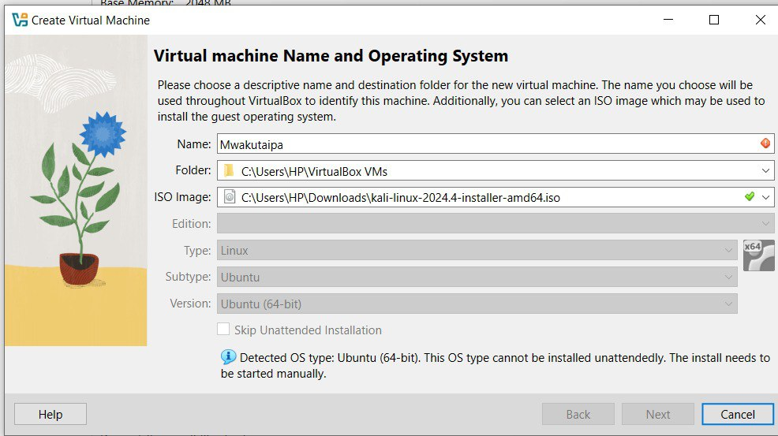{#fig:001 width=70%}

## Итог

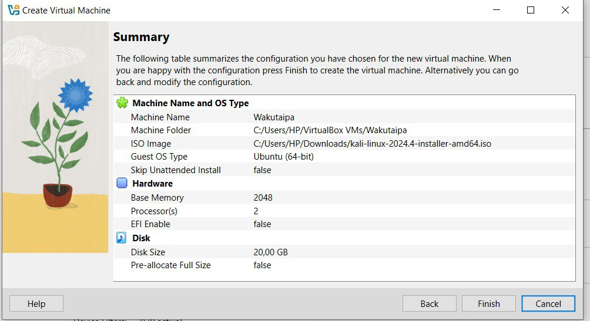{#fig:004 width=70%}

## Окно установки

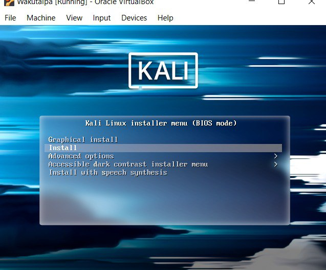{#fig:005 width=70%}

## Подключенный образ

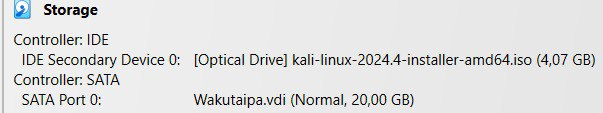{#fig:006 width=70%}

## язык установки

{#fig:007 width=70%}

## Локация 

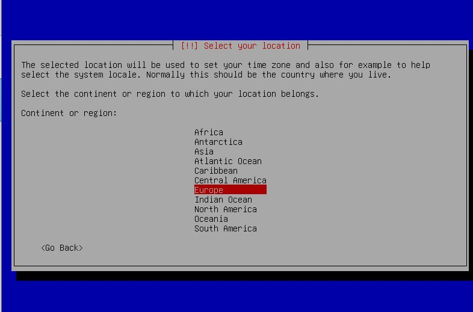{#fig:008 width=70%}

## конфигурация клавиатуры (язык).

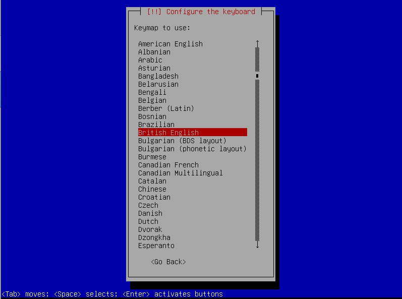{#fig:009 width=70%}

## Настройки сети 

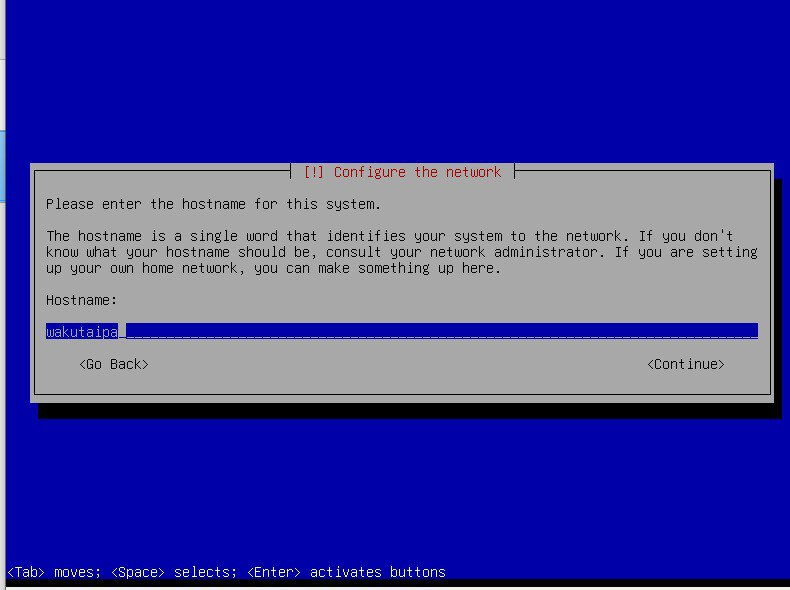{#fig:010 width=70%}

## Создание пользователя 

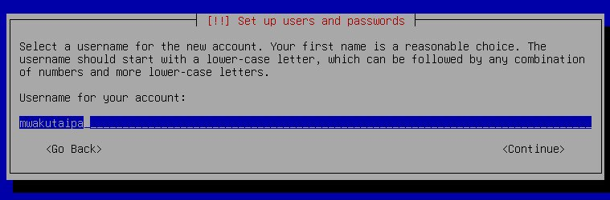{#fig:011 width=70%}

## Настройки часов

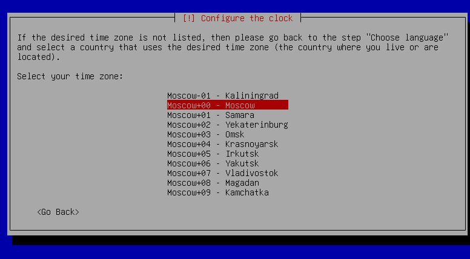{#fig:013 width=70%}

## Выбор диска 

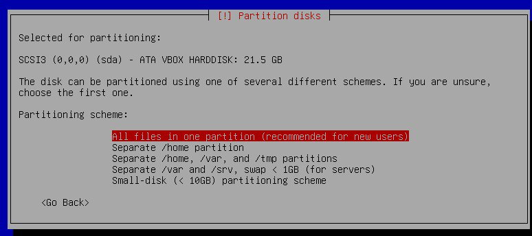{#fig:0014 width=70%}

## Установка системы

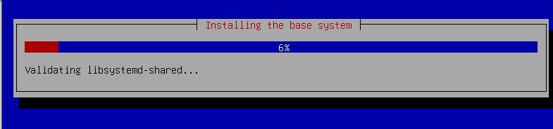{#fig:015 width=70%}

## Выбор UI

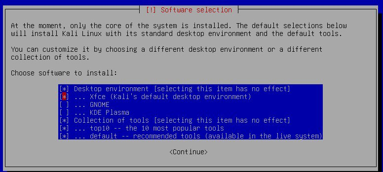{#fig:016 width=70%}

## Домашний экран 

{#fig:018 width=70%}

## Пустой носитель

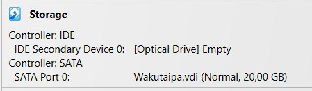{#fig:019 width=70%}

# Выводы

Получила навыков по установке ОС на менеджер виртуальных машин.
