---
## Front matter
title: "Отчёт по индивидуальному проекту"
subtitle: "Установка Kali Linux"
author: "Вакутайпа Милдред"

## Generic otions
lang: ru-RU
toc-title: "Содержание"

## Bibliography
bibliography: bib/cite.bib
csl: pandoc/csl/gost-r-7-0-5-2008-numeric.csl

## Pdf output format
toc: true # Table of contents
toc-depth: 2
lof: true # List of figures
fontsize: 12pt
linestretch: 1.5
papersize: a4
documentclass: scrreprt
## I18n polyglossia
polyglossia-lang:
  name: russian
  options:
	- spelling=modern
	- babelshorthands=true
polyglossia-otherlangs:
  name: english
## I18n babel
babel-lang: russian
babel-otherlangs: english
## Fonts
mainfont: IBM Plex Serif
romanfont: IBM Plex Serif
sansfont: IBM Plex Sans
monofont: IBM Plex Mono
mathfont: STIX Two Math
mainfontoptions: Ligatures=Common,Ligatures=TeX,Scale=0.94
romanfontoptions: Ligatures=Common,Ligatures=TeX,Scale=0.94
sansfontoptions: Ligatures=Common,Ligatures=TeX,Scale=MatchLowercase,Scale=0.94
monofontoptions: Scale=MatchLowercase,Scale=0.94,FakeStretch=0.9
mathfontoptions:
## Biblatex
biblatex: true
biblio-style: "gost-numeric"
biblatexoptions:
  - parentracker=true
  - backend=biber
  - hyperref=auto
  - language=auto
  - autolang=other*
  - citestyle=gost-numeric
## Pandoc-crossref LaTeX customization
figureTitle: "Рис."
listingTitle: "Листинг"
lofTitle: "Список иллюстраций"
lolTitle: "Листинги"
## Misc options
indent: true
header-includes:
  - \usepackage{indentfirst}
  - \usepackage{float} # keep figures where there are in the text
  - \floatplacement{figure}{H} # keep figures where there are in the text
---

# Цель работы

Получение навыков по установке ОС на менеджер виртуальных машин.

# Задание

Установить дистрибутив Linux.

# Выполнение лабораторной работы

Открываю приложение VirtualBox и создаю новую машину.

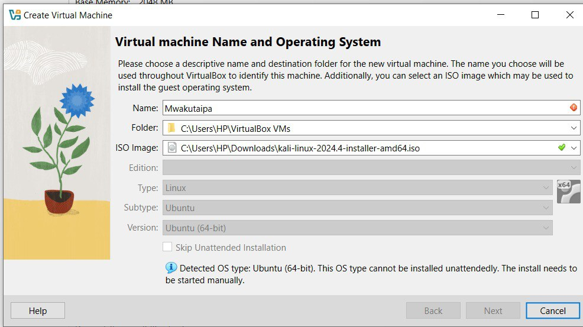{#fig:001 width=70%}

Создаю виртуальный диск и задаю оперативную память.

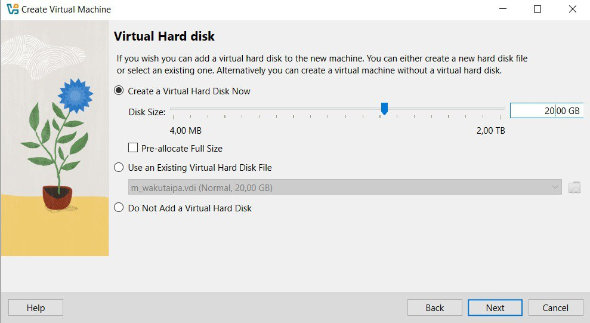{#fig:002 width=70%}

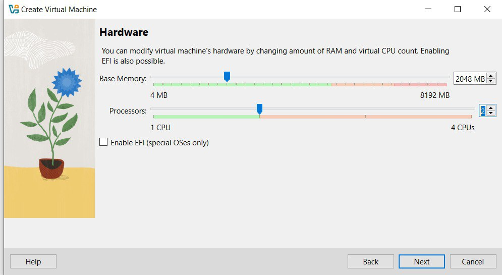{#fig:003 width=70%}

Затем соглашаюсь с выбором и запускаю машину.

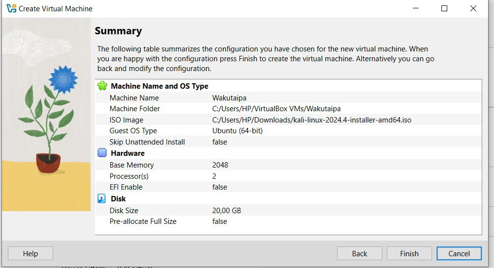{#fig:004 width=70%}

Выбираю install чтобы начать установка

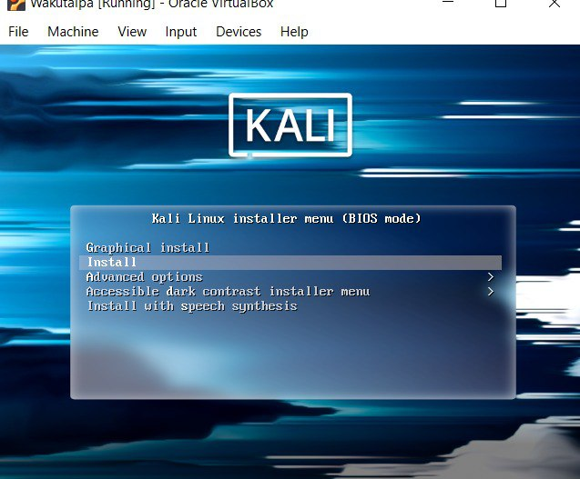{#fig:005 width=70%}

При этом замечаю, что образ диска подключен к носителью.

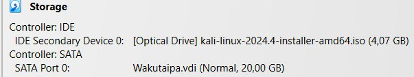{#fig:006 width=70%}

Далее выбираю все по моему хотению: Язык установки - английский;

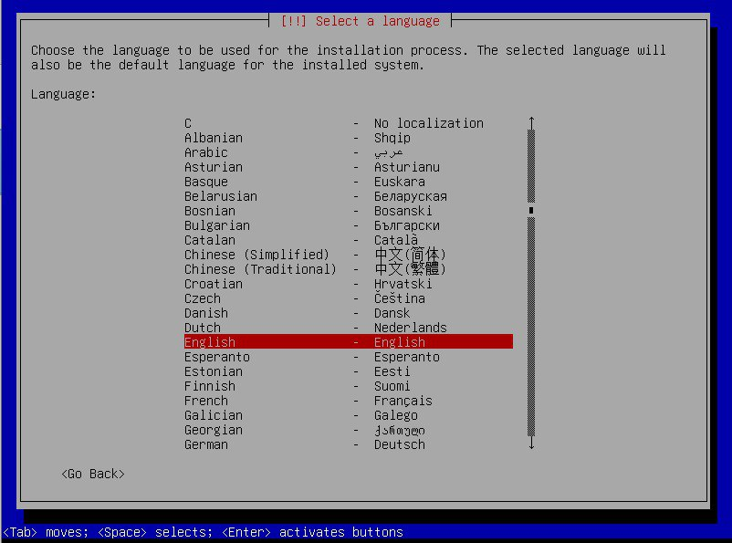{#fig:007 width=70%}

Локация - Европа;

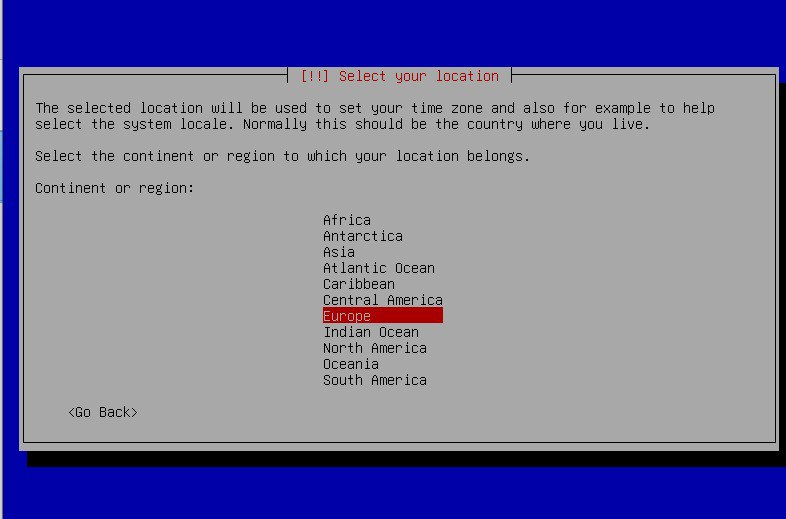{#fig:008 width=70%}

конфигурация клавиатуры (язык).

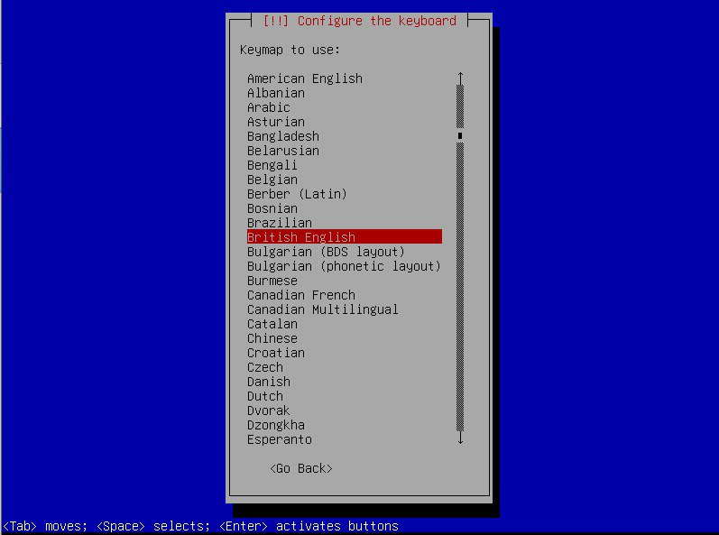{#fig:009 width=70%}

Настрою сеть. В качестве имени сети задаю мое.

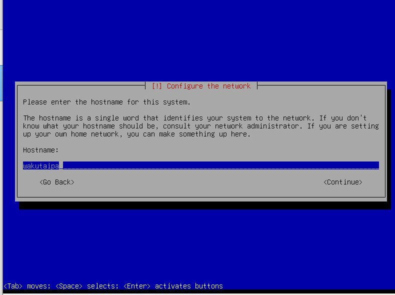{#fig:010 width=70%}

Создаю пользователя, устанавливаю пароль и настраиваю часы.

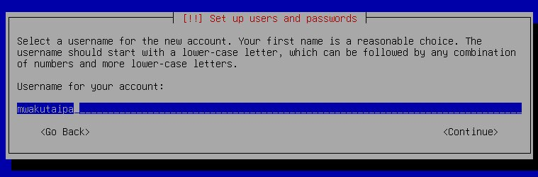{#fig:011 width=70%}

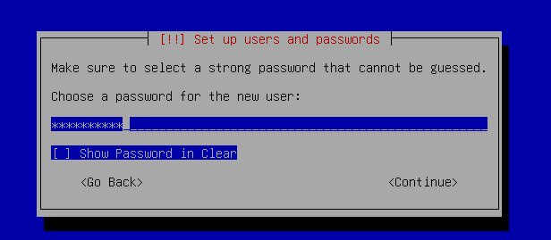{#fig:012 width=70%}

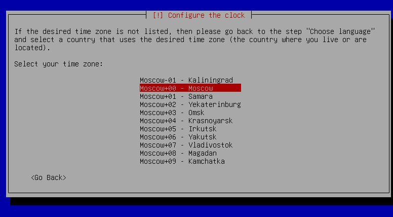{#fig:013 width=70%}

Выбираю диск для работы и сохранния настройки.

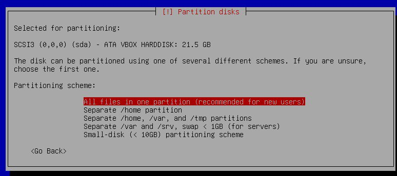{#fig:0014 width=70%}

Далее все настройки сохраняю и устанавливаю систему.

{#fig:015 width=70%}

Выбираю окружение рабочий стол и завершаю установки.

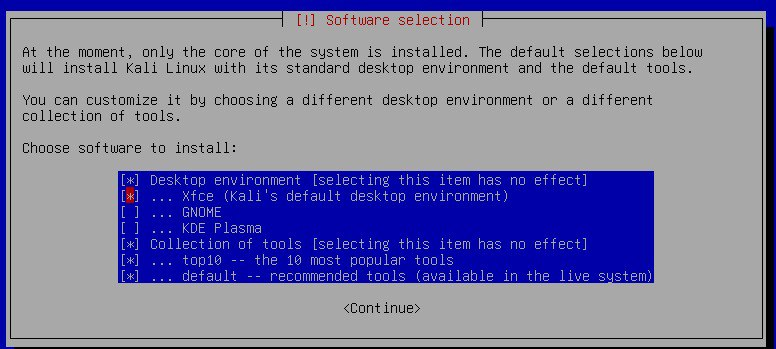{#fig:016 width=70%}

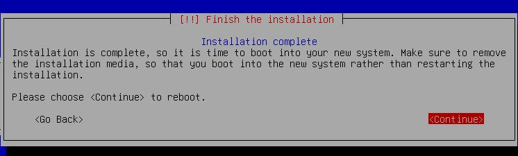{#fig:017 width=70%}

{#fig:018 width=70%}

Проверяю ,что образ диска пропал, что значит все хорошо устанвлено.

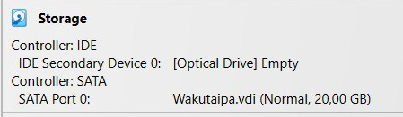{#fig:019 width=70%}

# Выводы

Получила навыков по установке ОС на менеджер виртуальных машин.
