---
## Front matter
lang: ru-RU
title: Второй этап индивидуального проекта
subtitle: Установка DVWA
author:
  - Вакутайпа М.
institute:
  - Российский университет дружбы народов, Москва, Россия
date: 16 марта 2025

## i18n babel
babel-lang: russian
babel-otherlangs: english

## Formatting pdf
toc: false
toc-title: Содержание
slide_level: 2
aspectratio: 169
section-titles: true
theme: metropolis
header-includes:
 - \metroset{progressbar=frametitle,sectionpage=progressbar,numbering=fraction}
---

# Информация

## Докладчик

:::::::::::::: {.columns align=center}
::: {.column width="70%"}

  * Вакутайпа Милдред
  * НКАбд 02-23
  * Факультет Физико-математических и естесвенных наук
  * Российский университет дружбы народов
  * [1032239009@rudn.ru](mailto:1032239009@rudn.ru)
  * <https://wakutaipa.github.io/ru/>

:::
::: {.column width="30%"}
:::
::::::::::::::

# Цель работы

Получить практические навыки по установке DVWA.

# Задание

1. Установить DVWA.

# Выполнение лабораторной работы

## репзиторий DVWA

Открою github и захожу в репозиторий dvwa и копирую ссылку.

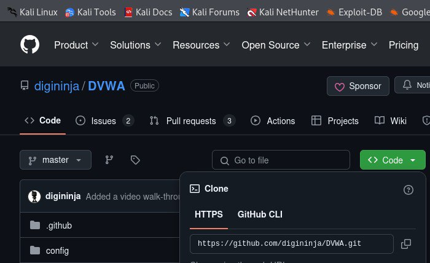{#fig:001 width=70%}

## Клонирование DVWA в /html

Открою терминал, и с помощью cd, вхожу в директорию html, где сохраняются файлы локального хоста. В этой же директории клонирую репозиторий.

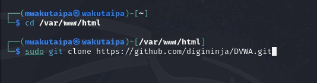{#fig:002 width=70%}

## chmod -R 777

С помощью ls поверяю, что клонирование было успешно и потом разрешаю все права на все файлы в DVWA используя chmod -R 777

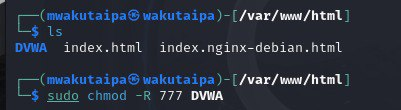{#fig:003 width=70%}

## директория config

Проверяю работу и захожу в dvwa/config, чтобы настроить веб-приложение.

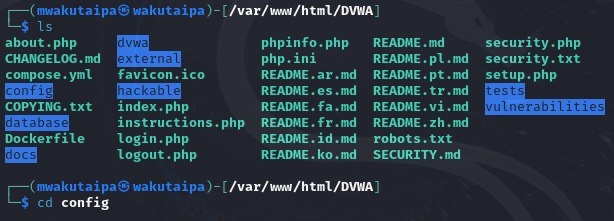{#fig:004 width=70%}

## копирование config.int.php

Далее копирую config.int.php который содержит конфигурацию приложения.

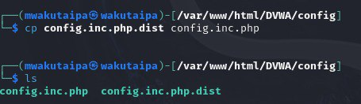{#fig:005 width=70%}

## редактирование файла конфигурации

В этом файле изменяю пароль, имя пользователя на  mwaku и создаю базу данных waku и сохраняю изменения.

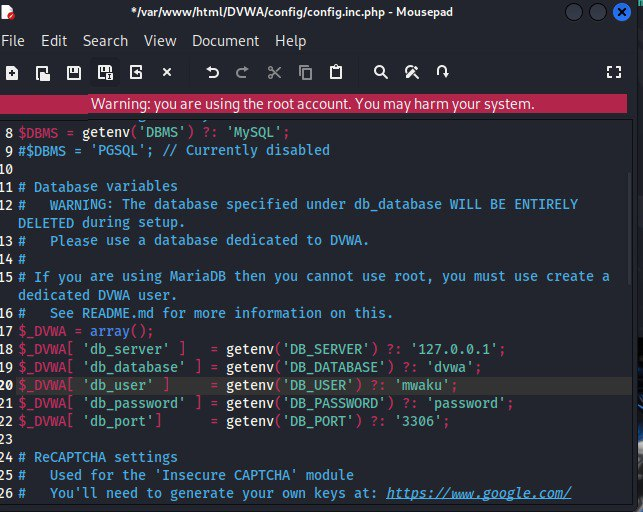{#fig:006 width=70%}

## Запуск mysql

Запускаю mysql с помощью start mysql и проверяю используя status mysql.

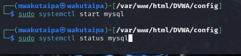{#fig:007 width=70%}

## проверка работы mysql

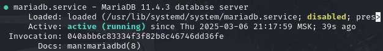{#fig:008 width=70%}

## вход в mysql

Далее я вхожу в mmysql используя mysql -u root -p 

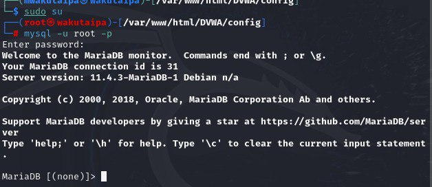{#fig:009 width=70%}

## создание пользоателя

Создаю базу данных waku и нового пользователя используя create user 'mwaku'@'127.0.0.1' identified by 'password'. Используя эту команду, создала пользователя mwaku, работаюшего на сервер локального хоста (127.0.0.1) и пароль password.

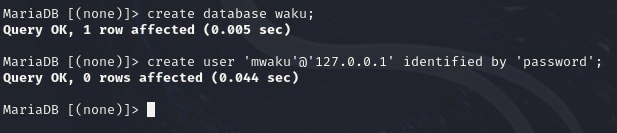{#fig:0010 width=70%}

## Разрешение права

Разрешаю все правав доступа этому пользователю к базе данных и завершаю работы.

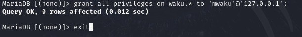{#fig:0011 width=70%}

## Запуск apache2

Запускаю сервер apache2.

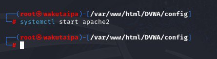{#fig:0012 width=70%}

## вход в /etc/php/8.2

Далее вхожу в /etc/php/8.2. 

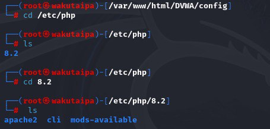{#fig:0013 width=70%}

## Включение  allow_url

Включаю значения allow_url_fopen и allow_url_include в файле apache2/php.ini.

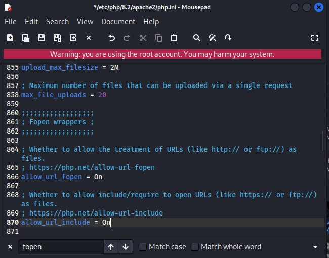{#fig:0014 width=70%}

## Перезапуск apache2

Перезапускаю сервер apache2 испоьзуя systemctl restart apache2. 

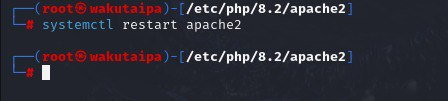{#fig:0015 width=70%}

## страница веб-приложения

Открою 127.0.0.1./dvwa/setup.php в браузере.   

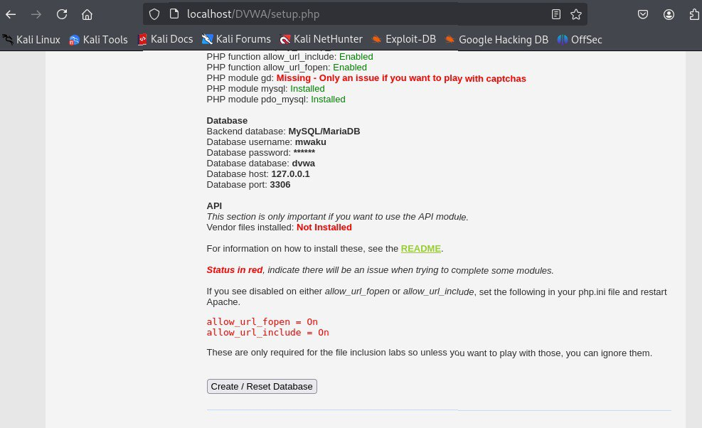{#fig:0016 width=70%}

## Вход в DVWA

Нажимаю кнопку create/Reset database. Создается базу данных и мне перенаправляют на страницу входа. Вхожу используя логин admin и пароль p@ssword.

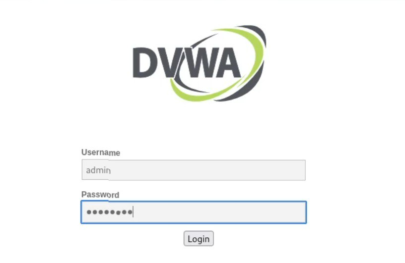{#fig:0017 width=70%}

## Домшняя страница dvwa

После входа попадаем на домашнюю страницу dvwa.

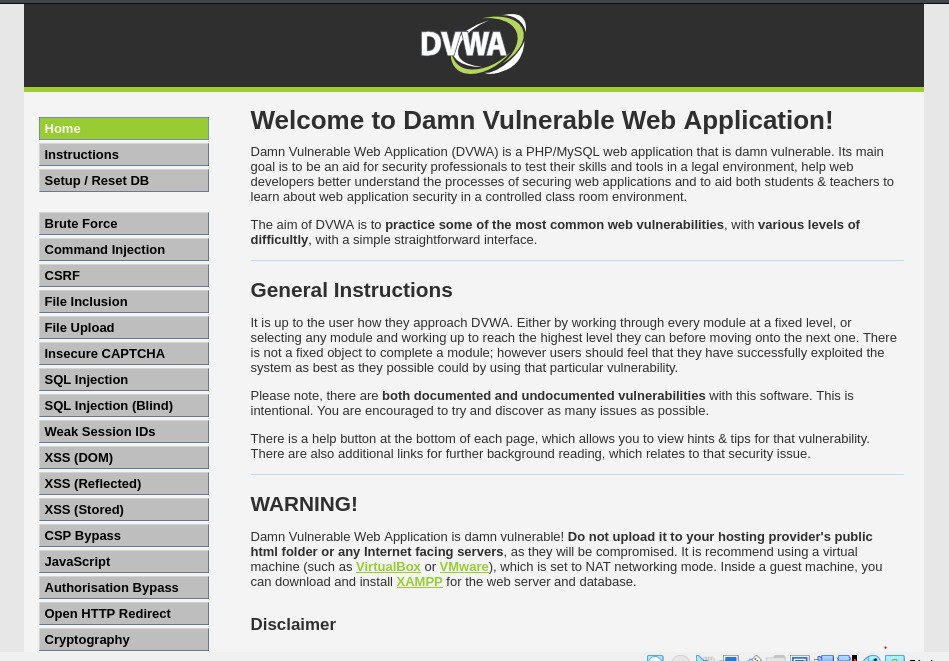{#fig:0018 width=70%}

# Выводы

Получила навыки по установке DVWA.

# Список литературы{.unnumbered}

[Set up DVWA in Kali Linux][https://akshaygupta21.medium.com/how-to-setup-dvwa-in-kali-linux-e7c0dc272bba]
