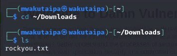
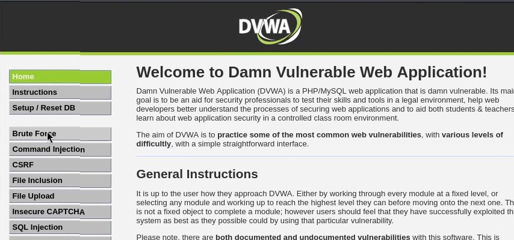
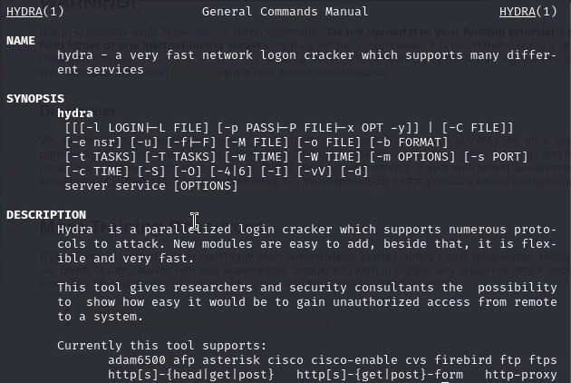
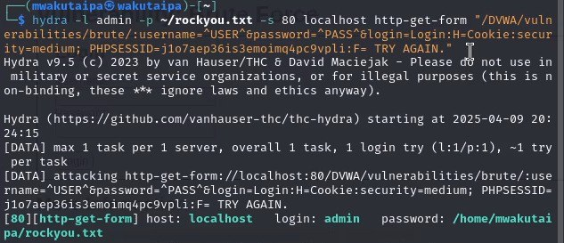
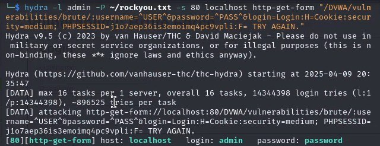
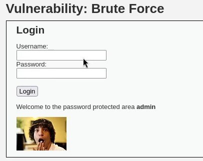

---
## Front matter
lang: ru-RU
title: Третий Этап Индивидуального Проекта
subtitle: Hydra. Bruteforce
author:
  - Вакутайпа М.
institute:
  - Российский университет дружбы народов, Москва, Россия
date: 09 апреля 2025

## i18n babel
babel-lang: russian
babel-otherlangs: english

## Formatting pdf
toc: false
toc-title: Содержание
slide_level: 2
aspectratio: 169
section-titles: true
theme: metropolis
header-includes:
 - \metroset{progressbar=frametitle,sectionpage=progressbar,numbering=fraction}
---

# Информация

## Докладчик

:::::::::::::: {.columns align=center}
::: {.column width="70%"}

  * Вакутайпа Милдред
  * НКАбд-02-23
  * факультет физико-математических и естественных наук
  * Российский университет дружбы народов
  * [1032239009@rudn.ru](mailto:1032239009@rudn.ru)
  * <https://wakutaipa.github.io/ru/>

:::
::::::::::::::

# Цель работы

Получить практические навыки по использованию hydra для брутфорса паролей.

# Выполнение работы

## Загрузка список паролей

Перед началой работы, я установила список часто всречающихся паролей. Прверяю ,что список есть и продолжаю работу:

{#fig:001 width=70%}

## DVWA домашняя страница

Потом войду в аккаунт DVWA, который создала в предыдущой работы и нажимаю brute force:

{#fig:002 width=70%}

## информация по hydra

С помощью man читаю справку по hydra, чтобы понять чуть подробнее с чем он работает. Мне понадобится опции -l (логин) и -p(пароль):

{#fig:003 width=70%}

## Попытка 1 взломать пароль

Пароль побираю для пользователя admin с файла rockyou.txt используя get-запрос с параметрами cookie и PHPSESSID. При использовании -p, выводится пароль как имя и место положение файла (home/mwakutaipa/rockyou.txt):

{#fig:004 width=70%}

## Попытка 2 взломать пароль

При использовании -P пароль выводится:

{#fig:005 width=70%}

## Проверка

Вхожу в систему с данной паролей чтобы проверят ,что пароль правилный:

{#fig:006 width=70%}

# Выводы

Получила практические навыки по использованию hydra для брутфорса паролей.

