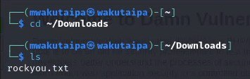
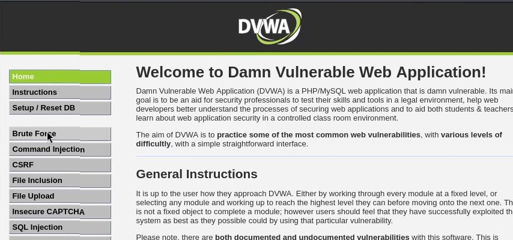
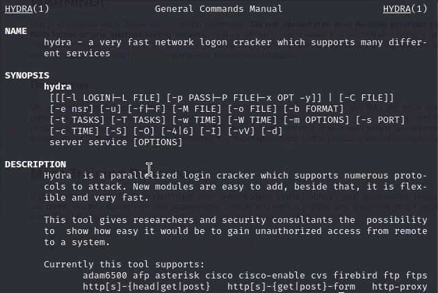
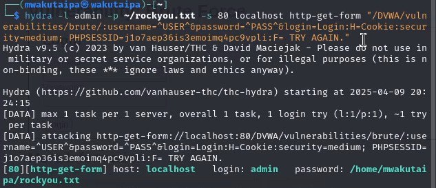
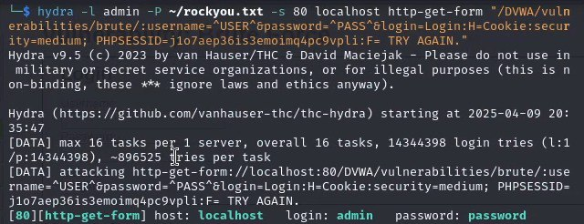
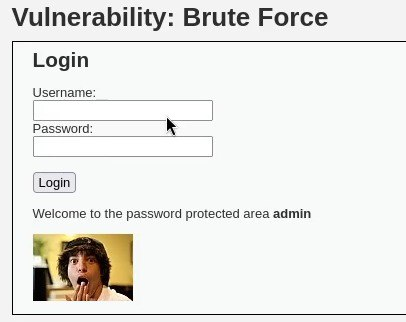

---
## Front matter
title: "Отчет по индивидуальному проекту. Этап 3"
subtitle: "Hydra. Bruteforce, DVWA"
author: "Вакутайпа Милдред"

## Generic otions
lang: ru-RU
toc-title: "Содержание"

## Bibliography
bibliography: bib/cite.bib
csl: pandoc/csl/gost-r-7-0-5-2008-numeric.csl

## Pdf output format
toc: true # Table of contents
toc-depth: 2
lof: true # List of figures
lot: true # List of tables
fontsize: 12pt
linestretch: 1.5
papersize: a4
documentclass: scrreprt
## I18n polyglossia
polyglossia-lang:
  name: russian
  options:
	- spelling=modern
	- babelshorthands=true
polyglossia-otherlangs:
  name: english
## I18n babel
babel-lang: russian
babel-otherlangs: english
## Fonts
mainfont: IBM Plex Serif
romanfont: IBM Plex Serif
sansfont: IBM Plex Sans
monofont: IBM Plex Mono
mathfont: STIX Two Math
mainfontoptions: Ligatures=Common,Ligatures=TeX,Scale=0.94
romanfontoptions: Ligatures=Common,Ligatures=TeX,Scale=0.94
sansfontoptions: Ligatures=Common,Ligatures=TeX,Scale=MatchLowercase,Scale=0.94
monofontoptions: Scale=MatchLowercase,Scale=0.94,FakeStretch=0.9
mathfontoptions:
## Biblatex
biblatex: true
biblio-style: "gost-numeric"
biblatexoptions:
  - parentracker=true
  - backend=biber
  - hyperref=auto
  - language=auto
  - autolang=other*
  - citestyle=gost-numeric
## Pandoc-crossref LaTeX customization
figureTitle: "Рис."
tableTitle: "Таблица"
listingTitle: "Листинг"
lofTitle: "Список иллюстраций"
lotTitle: "Список таблиц"
lolTitle: "Листинги"
## Misc options
indent: true
header-includes:
  - \usepackage{indentfirst}
  - \usepackage{float} # keep figures where there are in the text
  - \floatplacement{figure}{H} # keep figures where there are in the text
---

# Цель работы

Получить практические навыки по использованию hydra для брутфорса паролей.

# Задание

Реализовать эксплуатацию уязвимости с помощью bruteforce паролей.

# Выполнение лабораторной работы

Перед началой работы, я установила список часто всречающихся паролей. Прверяю ,что список есть и продолжаю работу:

{#fig:001 width=70%}

Потом войду в аккаунт DVWA, который создала в предыдущой работы и нажимаю brute force:

{#fig:002 width=70%}

С помощью man читаю справку по hydra, чтобы понять чуть подробнее с чем он работает. Мне понадобится опции -l (логин) и -p(пароль):

{#fig:003 width=70%}

Пароль побираю для пользователя admin с файла rockyou.txt используя get-запрос с параметрами cookie и PHPSESSID. При использовании -p, выводится пароль как имя и место положение файла (home/mwakutaipa/rockyou.txt):

{#fig:004 width=70%}

При использовании -P пароль выводится:

{#fig:005 width=70%}

Вхожу в систему с данной паролей чтобы проверят ,что пароль правилный:

{#fig:006 width=70%}

# Выводы

Получила практические навыки по использованию hydra для брутфорса паролей.

# Список литературы{.unnumbered}

::: {#refs}
:::
