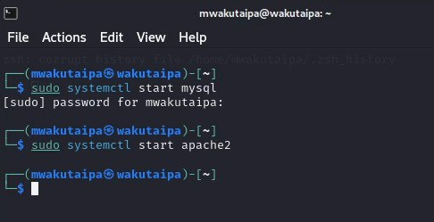
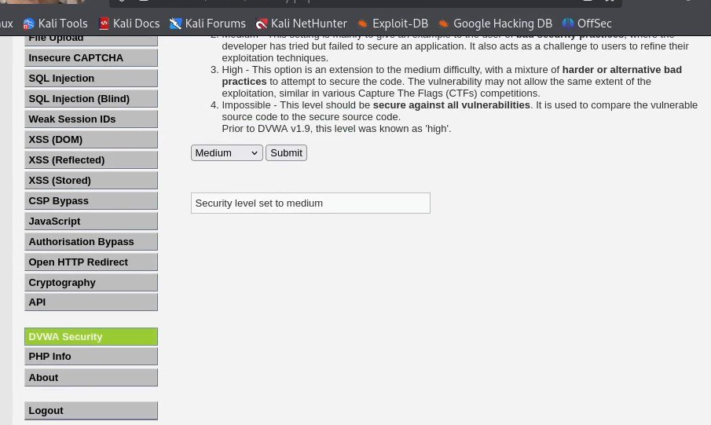
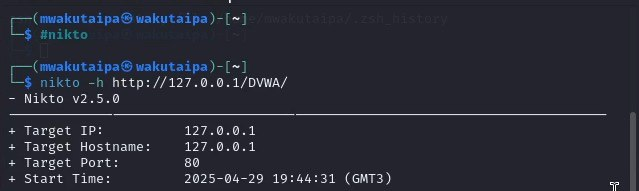
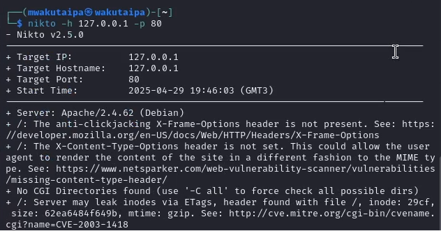

---
## Front matter
lang: ru-RU
title: Презентация по четвертому этапу индивидуального проекта
subtitle: Сканер nikto
author:
  - Вакутайпа М.
institute:
  - Российский университет дружбы народов, Москва, Россия
date: 01 мая 2025

## i18n babel
babel-lang: russian
babel-otherlangs: english

## Formatting pdf
toc: false
toc-title: Содержание
slide_level: 2
aspectratio: 169
section-titles: true
theme: metropolis
header-includes:
 - \metroset{progressbar=frametitle,sectionpage=progressbar,numbering=fraction}
---

# Информация

## Докладчик

:::::::::::::: {.columns align=center}
::: {.column width="70%"}

  * Вакутайпа Милдред
  * НКАбд-02-23
  * Факультет физико-математических и естественных наук
  * Российский университет дружбы народов
  * [1032239009@rudn.ru](mailto:1032239009@rudn.ru)
  * <https://wakutaipa.github.io>

:::
::::::::::::::

# Цель работы

Научиться тестировать веб-приложений со сканером nikto.

# Выполнение работы

## запуск сервера

По скольку буду сканировать веб-приложение DVWA запускаю его.

{#fig:001 width=70%}

## Изменение уровня безопасности

Далее изменяю уровня безопасности на среднее.

{#fig:002 width=70%}

## Сканирование 1 с nikto

Запускаю nikto используя #nikto и сканирую DVWA введя его польный URL без порта.

{#fig:003 width=70%}

## Сканирование 2 с nikto

Сканирую второй раз введя польный URL DVWA с портом и заметила, что результаты не сильно отличаются.

{#fig:004 width=70%}

# Выводы

Научилась тестировать веб-приложений со сканером nikto.

