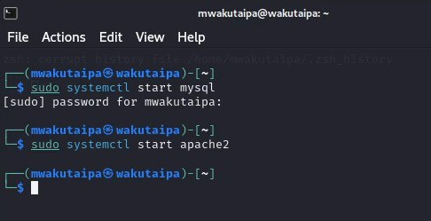
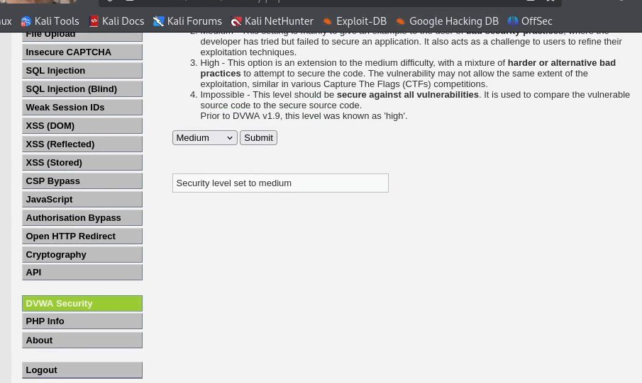
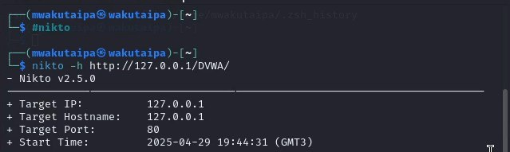
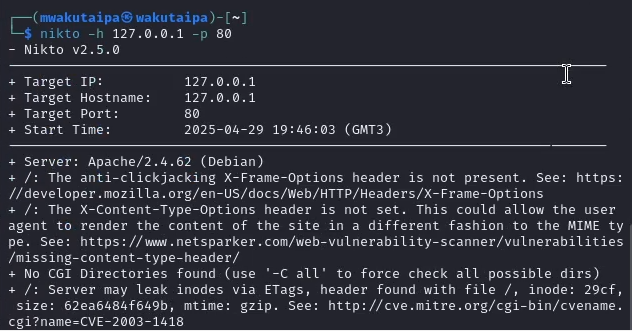

---
## Front matter
title: "Отчет по четвертому этапу индивидуального проекта"
subtitle: "Сканер nikto"
author: "Вакутайпа Милдред"

## Generic otions
lang: ru-RU
toc-title: "Содержание"

## Bibliography
bibliography: bib/cite.bib
csl: pandoc/csl/gost-r-7-0-5-2008-numeric.csl

## Pdf output format
toc: true # Table of contents
toc-depth: 2
lof: true # List of figures
lot: true # List of tables
fontsize: 12pt
linestretch: 1.5
papersize: a4
documentclass: scrreprt
## I18n polyglossia
polyglossia-lang:
  name: russian
  options:
	- spelling=modern
	- babelshorthands=true
polyglossia-otherlangs:
  name: english
## I18n babel
babel-lang: russian
babel-otherlangs: english
## Fonts
mainfont: IBM Plex Serif
romanfont: IBM Plex Serif
sansfont: IBM Plex Sans
monofont: IBM Plex Mono
mathfont: STIX Two Math
mainfontoptions: Ligatures=Common,Ligatures=TeX,Scale=0.94
romanfontoptions: Ligatures=Common,Ligatures=TeX,Scale=0.94
sansfontoptions: Ligatures=Common,Ligatures=TeX,Scale=MatchLowercase,Scale=0.94
monofontoptions: Scale=MatchLowercase,Scale=0.94,FakeStretch=0.9
mathfontoptions:
## Biblatex
biblatex: true
biblio-style: "gost-numeric"
biblatexoptions:
  - parentracker=true
  - backend=biber
  - hyperref=auto
  - language=auto
  - autolang=other*
  - citestyle=gost-numeric
## Pandoc-crossref LaTeX customization
figureTitle: "Рис."
tableTitle: "Таблица"
listingTitle: "Листинг"
lofTitle: "Список иллюстраций"
lotTitle: "Список таблиц"
lolTitle: "Листинги"
## Misc options
indent: true
header-includes:
  - \usepackage{indentfirst}
  - \usepackage{float} # keep figures where there are in the text
  - \floatplacement{figure}{H} # keep figures where there are in the text
---

# Цель работы

Научиться тестировать веб-приложений со сканером nikto.

# Выполнение лабораторной работы

По скольку буду сканировать веб-приложение DVWA запускаю его.

{#fig:001 width=70%}

Далее изменяю уровня безопасности на среднее.

{#fig:002 width=70%}

Запускаю nikto используя #nikto и сканирую DVWA введя его польный URL без порта.

{#fig:003 width=70%}

Сканирую второй раз введя польный URL DVWA с портом и заметила, что результаты не сильно отличаются.

{#fig:004 width=70%}

Кроме адреса хоста и порта веб-приложения, никто выводит инофрмацию о различных уязвимостях приложения как
сервер: Apache/2.4.58 (Debian)
/DVWA/: Заголовок X-Frame-Options, защищающий от перехвата кликов, отсутствует.
/DVWA/: Заголовок X-Content-Type-Options не задан. Это может позволить пользовательскому агенту отображать содержимое сайта способом, отличным от MIME-типа.
Корневая страница /DVWA перенаправляет на: login.php
Каталоги CGI не найдены (используйте '-C all', чтобы принудительно проверить все возможные каталоги)
ОПЦИИ: Разрешенные HTTP-методы: GET, POST, OPTIONS, HEAD .
/DVWA///etc/hosts: Установка сервера позволяет считывать любой системный файл, добавляя дополнительный "/" к URL-адресу.
/DVWA/config/: Найдена индексация каталога.
/DVWA/config/: Информация о конфигурации может быть доступна удаленно.
/DVWA/tests/: Найдена индексация каталога.
/DVWA/tests/: Это может быть интересно.
/DVWA/database/: Найдена индексация каталога.
/DVWA/база данных/: Найден каталог базы данных.
/DVWA/документы/: Найдена индексация каталога.
/DVWA/login.php: Найдена страница входа администратора/раздел.
/DVWA/.git/index: Индексный файл Git может содержать информацию о списке каталогов.
/DVWA/.git/HEAD: Найден файл Git HEAD. Может содержаться полная информация о репозитории.
/DVWA/.git/config: Найден конфигурационный файл Git. Может содержаться информация о деталях репозитория.
/DVWA/.gitignore: найден файл .gitignore. Можно разобраться в структуре каталогов.
/DVWA/wp-content/themes/twentyeleven/images/headers/server.php?filesrc=/etc/hosts: Обнаружен файловый менеджер с бэкдором на PHP.
/DVWA/wordpress/wp-content/themes/twentyeleven/images/headers/server.php?filesrc=/etc/hosts: Обнаружен файловый менеджер с бэкдором на PHP.
/DVWA/wp-includes/Requests/Utility/content-post.php?filesrc=/etc/hosts: Найден файловый менеджер с бэкдором на PHP.
/DVWA/wordpress/wp-includes/Requests/Utility/content-post.php?filesrc=/etc/hosts: Найден файловый менеджер с бэкдором на PHP.
/DVWA/wp-включает в себя/js/tinymce/themes/modern/Meuhy.php?filesrc=/etc/hosts: Найден файловый менеджер бэкдора PHP.
/DVWA/wordpress/wp-включает в себя/js/tinymce/themes/modern/Meuhy.php?filesrc=/etc/hosts: Найден файловый менеджер бэкдора на PHP.
/DVWA/assets/mobirise/css/meta.php?filesrc=: Найден файловый менеджер бэкдора на PHP.
/DVWA/shell?cat+/etc/hosts: Обнаружен черный ход.
/DVWA/.dockerignore: найден файл .dockerignore. Возможно, удастся разобраться в структуре каталогов и узнать больше о сайте.

Бэкдор — дефект алгоритма, который намеренно встраивается в него разработчиком и позволяет получить несанкционированный доступ к данным или удалённому управлению операционной системой и компьютером в целом.
Также в результатах nikto отображает код OSVDB 561 и дает ссылку на CVE-2003-1418. OSVDB — это аббревиатура базы данных уязвимостей с открытым исходным кодом.

# Выводы

Научилась тестировать веб-приложений со сканером nikto.

# Список литературы{.unnumbered}

::: {#refs}
:::
