---
## Front matter
lang: ru-RU
title: Презентация по пятому этапу индивидуального пректа
subtitle: Burb Suite
author:
  - Вакутайпа М.
institute:
  - Российский университет дружбы народов, Москва, Россия
date: 16 мая 2025

## i18n babel
babel-lang: russian
babel-otherlangs: english

## Formatting pdf
toc: false
toc-title: Содержание
slide_level: 2
aspectratio: 169
section-titles: true
theme: metropolis
header-includes:
 - \metroset{progressbar=frametitle,sectionpage=progressbar,numbering=fraction}
---

# Информация

## Докладчик

:::::::::::::: {.columns align=center}
::: {.column width="70%"}

  * Вакутайпа Милдред
  * НКАбд 02-23
  * Факультет физико-математических и естесвенных наук
  * Российский университет дружбы народов
  * [1032239009@rudn.ru](mailto:1032239009@rudn.ru)
  * <https://wakutaipa.github.io/ru/>

:::
::::::::::::::

# Цель работы

Научиться использовть Burp Suite.

# Выполнение лабораторной работы

## Запуск сервера

Запускаю локальный серевер DVWA: 

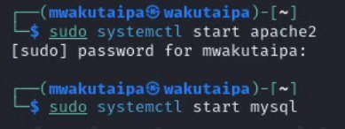{#fig:001 width=70%}

## Запуск Burp suite

Запускаю burp suite:

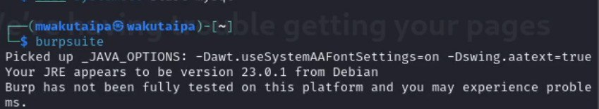{#fig:002 width=70%}

## сетевые настройки сервера

Открываю сетевые настройки браузера и изменяю настройки сервера для работы с proxy и захватом данных с burp suite:

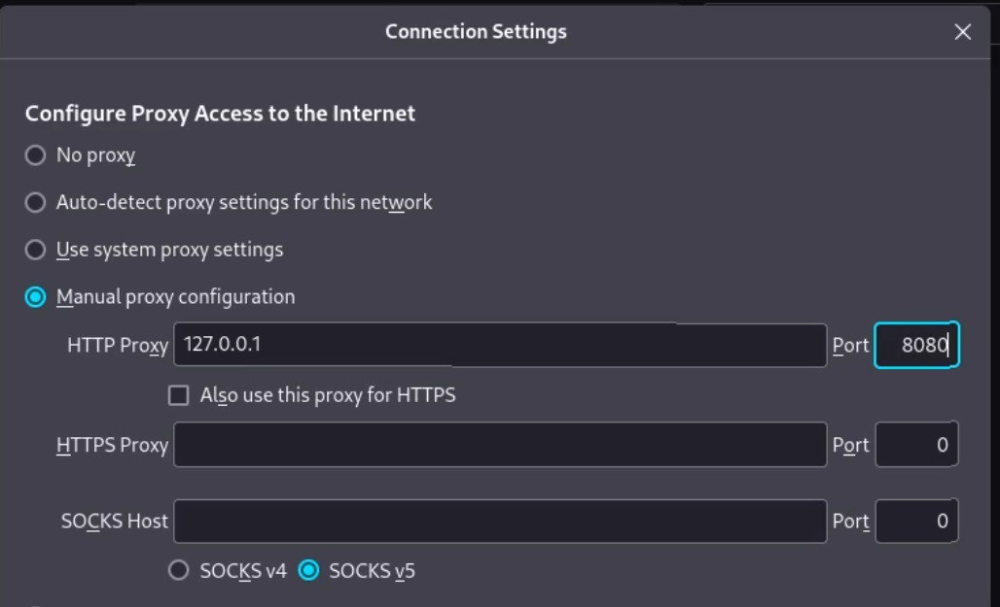{#fig:003 width=70%}

## настройки proxy

Изменяю настройки proxy инструмента burp suite:

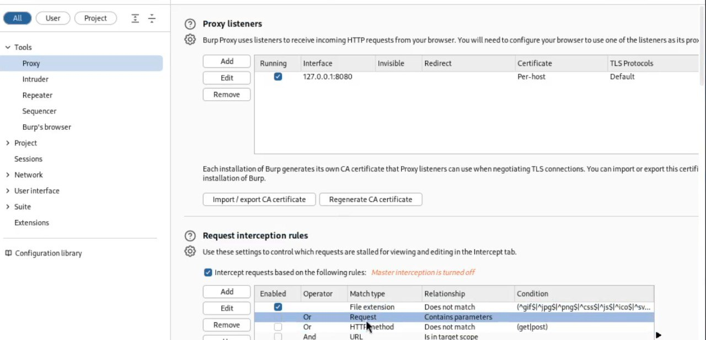{#fig:004 width=70%}

## Включение intercept

Включаю intercept во вкладе proxy:

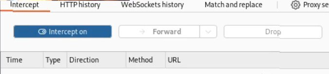{#fig:005 width=70%}

## Установка параметра локального хоста

Необходимо установить параметр network_allow_hijacking_localhost на true ,чтобы burp suite работал с локальным сервером. Я это и делала: 

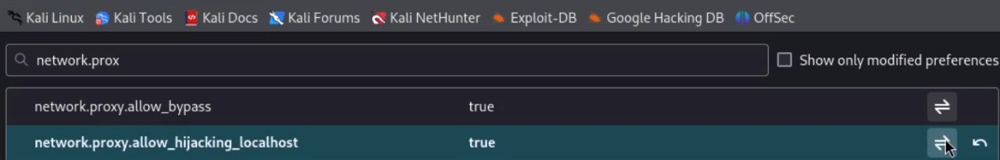{#fig:006 width=70%}

## Пытка зайти в dvwa

Пытаюсь зайти на dvwa в браузаре и во вкладки proxy появляется запрос. Нажимаю forward, чтобы загрузить страницу: 

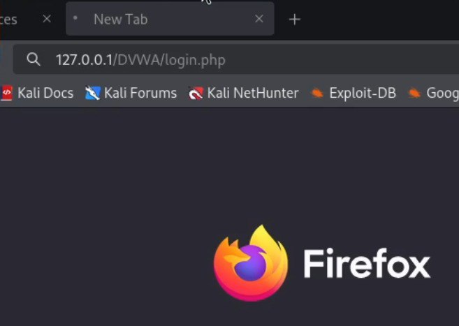{#fig:007 width=70%}

## вкладка proxy 

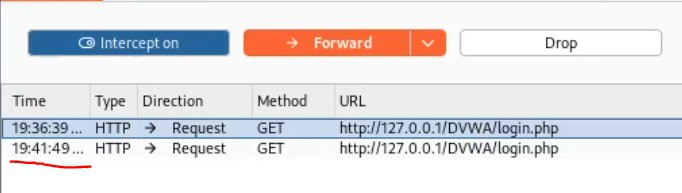{#fig:008 width=70%}

## окно dvwa 

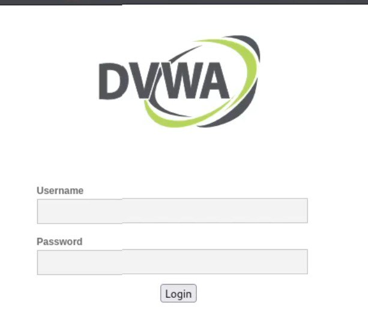{#fig:009 width=70%}

## Измененные данные

Когда пытаюсь ввести неправильные логин и пароль, в запросе появляется строка, в которой отображается введенные данные. Этот же запрос ,во вкладке target, отправила к злоумышленнику (send to intruder). Во вкладке intruder, изменяю тип атаки (на cluster bomb) и данные для входа. 

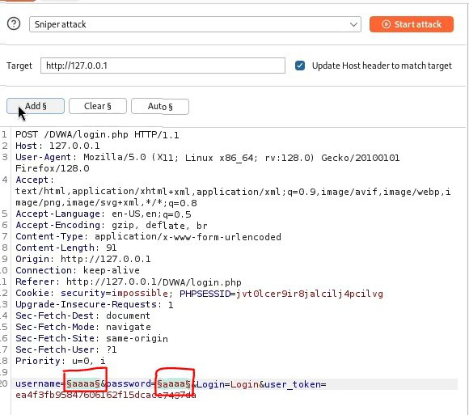{#fig:010 width=70%}

## Тип атака

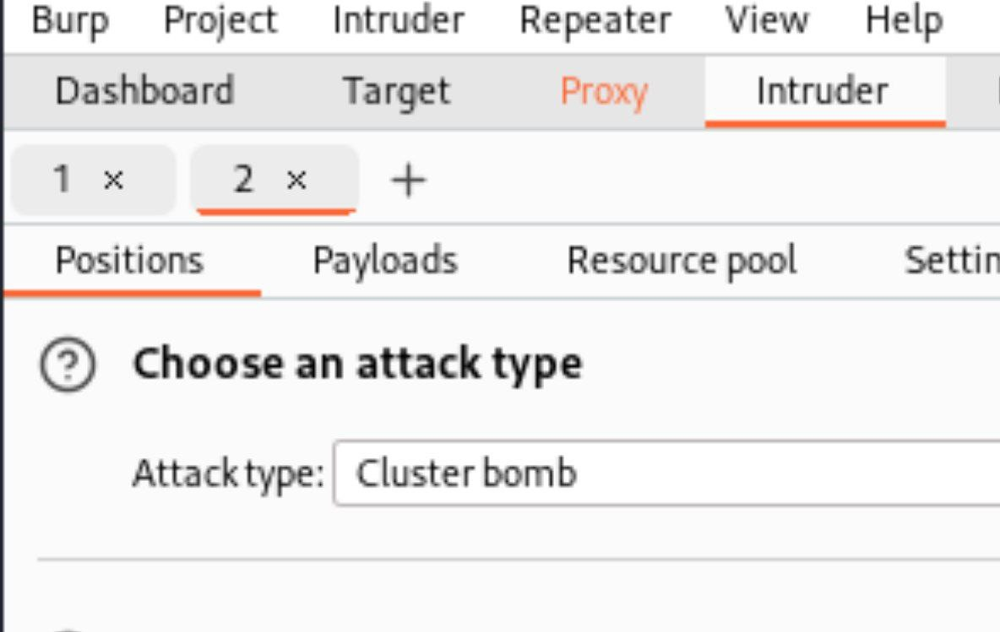{#fig:011 width=70%}

## Список 1

Отметила два параметра для подбора, поэтому создала два списка со значениями для подбора в payload:

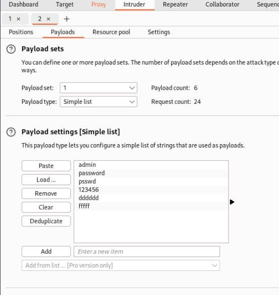{#fig:012 width=70%}

## Список 2

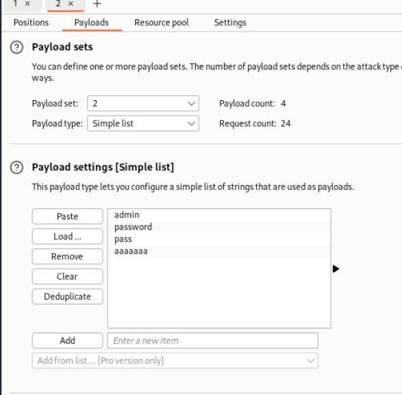{#fig:013 width=70%}

## Правильная пара

Далее запускаю атаку и начинаю подбор. При открытии каждого post-запроса можно увидеть полученный get-запрос, в нем видно, куда нас перенаправило после выполнения ввода пары пользователь-пароль. В этом случае с подбором пары нас перенаправило на страницу index.php, значит пара должна быть верной:

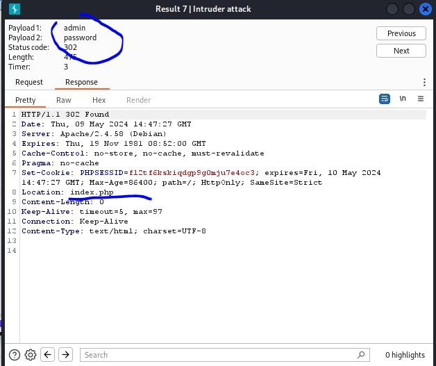{#fig:015 width=70%}

## Окна repeater и response

С использаванием repeater делаю доплнительную проверку. Нажимаю send и в response получаю результат перенаправление на index.php.

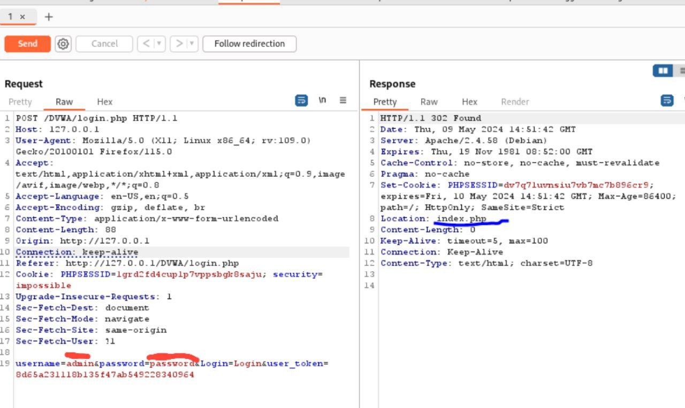{#fig:014 width=70%}

## Полученная страница

В подокне Render получаю то, как выглядит полученная страница:

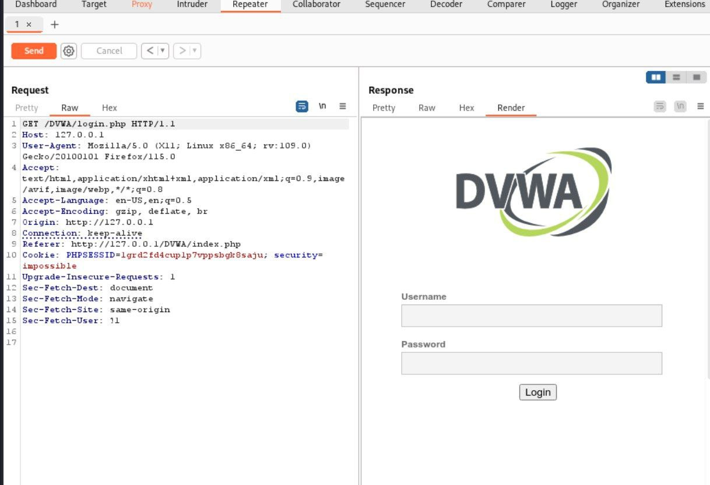{#fig:016 width=70%}

# Выводы

Научилась использовать Burp Suite.

