---
## Front matter
title: "Отчёт по пятому этапу индивидуального проекта"
subtitle: "Burp Suite"
author: "Вакутайпа Милдред"

## Generic otions
lang: ru-RU
toc-title: "Содержание"

## Bibliography
bibliography: bib/cite.bib
csl: pandoc/csl/gost-r-7-0-5-2008-numeric.csl

## Pdf output format
toc: true # Table of contents
toc-depth: 2
lof: true # List of figures
lot: true # List of tables
fontsize: 12pt
linestretch: 1.5
papersize: a4
documentclass: scrreprt
## I18n polyglossia
polyglossia-lang:
  name: russian
  options:
	- spelling=modern
	- babelshorthands=true
polyglossia-otherlangs:
  name: english
## I18n babel
babel-lang: russian
babel-otherlangs: english
## Fonts
mainfont: IBM Plex Serif
romanfont: IBM Plex Serif
sansfont: IBM Plex Sans
monofont: IBM Plex Mono
mathfont: STIX Two Math
mainfontoptions: Ligatures=Common,Ligatures=TeX,Scale=0.94
romanfontoptions: Ligatures=Common,Ligatures=TeX,Scale=0.94
sansfontoptions: Ligatures=Common,Ligatures=TeX,Scale=MatchLowercase,Scale=0.94
monofontoptions: Scale=MatchLowercase,Scale=0.94,FakeStretch=0.9
mathfontoptions:
## Biblatex
biblatex: true
biblio-style: "gost-numeric"
biblatexoptions:
  - parentracker=true
  - backend=biber
  - hyperref=auto
  - language=auto
  - autolang=other*
  - citestyle=gost-numeric
## Pandoc-crossref LaTeX customization
figureTitle: "Рис."
tableTitle: "Таблица"
listingTitle: "Листинг"
lofTitle: "Список иллюстраций"
lotTitle: "Список таблиц"
lolTitle: "Листинги"
## Misc options
indent: true
header-includes:
  - \usepackage{indentfirst}
  - \usepackage{float} # keep figures where there are in the text
  - \floatplacement{figure}{H} # keep figures where there are in the text
---

# Цель работы

Научиться использовть Burp Suite.

# Выполнение лабораторной работы

Запускаю локальный серевер DVWA: 

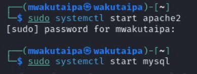{#fig:001 width=70%}

Запускаю burp suite:

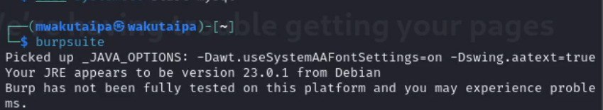{#fig:002 width=70%}

Открываю сетевые настройки браузера и изменяю настройки сервера для работы с proxy и захватом данных с burp suite:

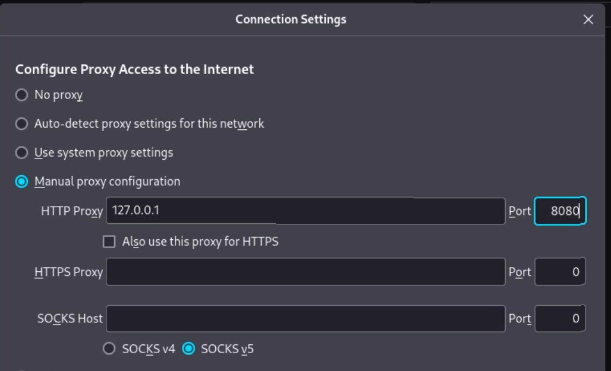{#fig:003 width=70%}

Изменяю настройки proxy инструмента burp suite:

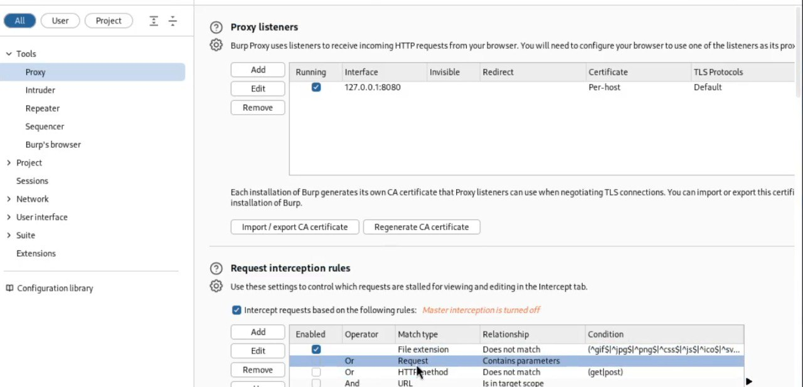{#fig:004 width=70%}

Включаю intercept во вкладе proxy:

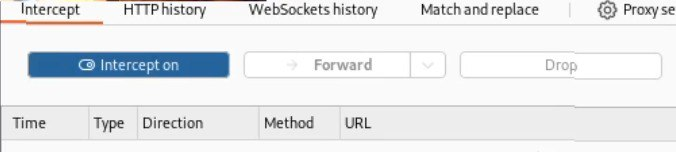{#fig:005 width=70%}

Необходимо установить параметр network_allow_hijacking_localhost на true ,чтобы burp suite работал с локальным сервером. Я это и делала: 

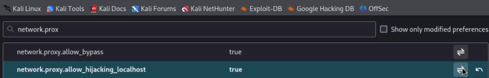{#fig:006 width=70%}

Пытаюсь зайти на dvwa в браузаре и во вкладки proxy появляется запрос. Нажимаю forward, чтобы загрузить страницу: 

{#fig:007 width=70%}

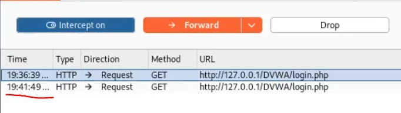{#fig:008 width=70%}

{#fig:009 width=70%}

Когда пытаюсь ввести неправильные логин и пароль, в запросе появляется строка, в которой отображается введенные данные. Этот же запрос ,во вкладке target, отправила к злоумышленнику (send to intruder). Во вкладке intruder, изменяю тип атаки (на cluster bomb) и данные для входа. 

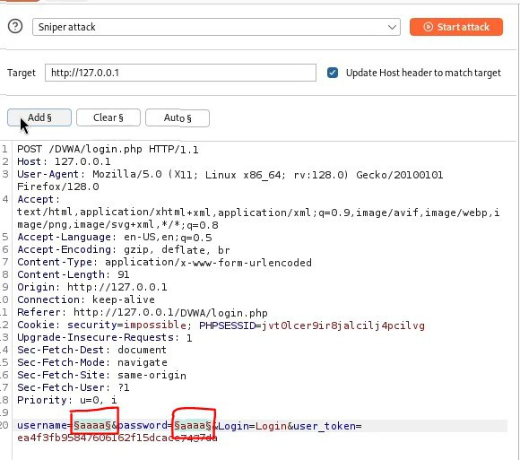{#fig:010 width=70%}

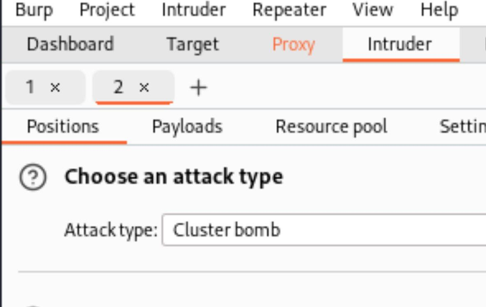{#fig:011 width=70%}

Отметила два параметра для подбора, поэтому создала два списка со значениями для подбора в payload:

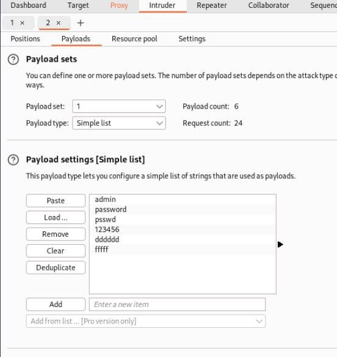{#fig:012 width=70%}

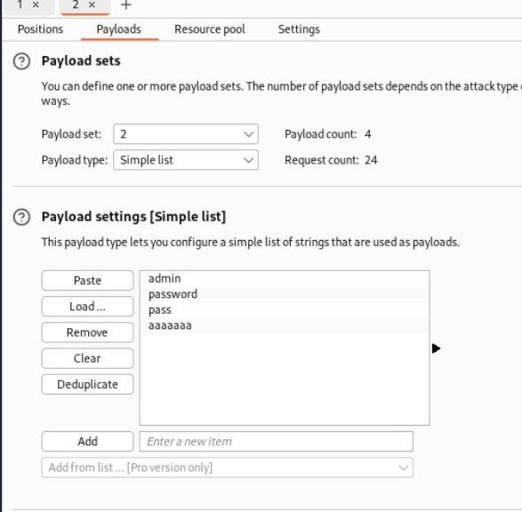{#fig:013 width=70%}

Далее запускаю атаку и начинаю подбор. При открытии каждого post-запроса можно увидеть полученный get-запрос, в нем видно, куда нас перенаправило после выполнения ввода пары пользователь-пароль. В этом случае с подбором пары нас перенаправило на страницу index.php, значит пара должна быть верной:

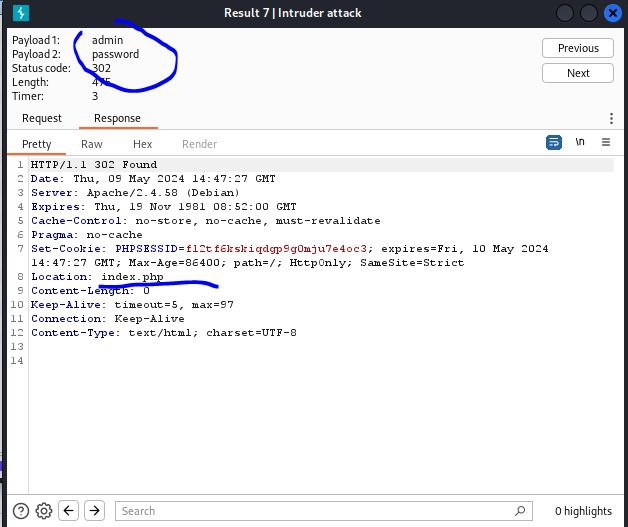{#fig:015 width=70%}

С использаванием repeater делаю доплнительную проверку. Нажимаю send и в response получаю результат перенаправление на index.php.

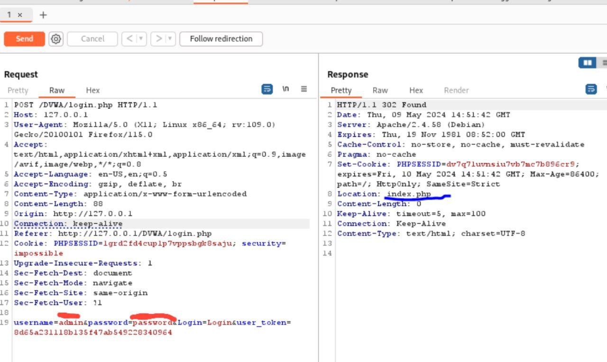{#fig:014 width=70%}

В подокне Render получаю то, как выглядит полученная страница:

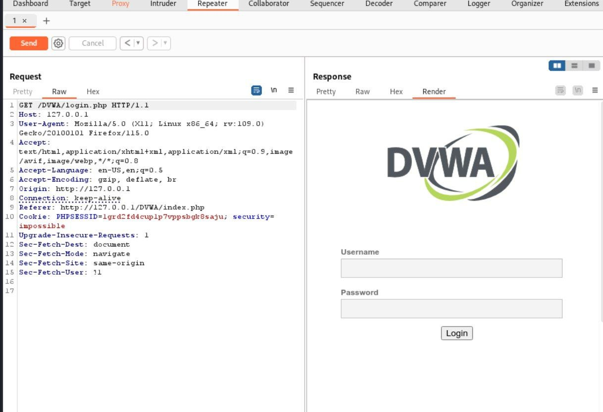{#fig:016 width=70%}

# Выводы

Научилась использовать Burp Suite.

# Список литературы{.unnumbered}

::: {#refs}
:::
