---
## Front matter
lang: ru-RU
title: Презентация по установки операционной системы
subtitle: Основы информационой безопасности
author:
  - Вакутайпа М.
institute:
  - Российский университет дружбы народов, Москва, Россия
date: 18 февраля 2025

## i18n babel
babel-lang: russian
babel-otherlangs: english

## Formatting pdf
toc: false
toc-title: Содержание
slide_level: 2
aspectratio: 169
section-titles: true
theme: metropolis
header-includes:
 - \metroset{progressbar=frametitle,sectionpage=progressbar,numbering=fraction}
---

# Информация

## Докладчик

:::::::::::::: {.columns align=center}
::: {.column width="70%"}

  * Вакутайпа Милдред
  * Физико-Математический факультет
  * Российский университет дружбы народов
  * [1032239009@rudn.ru](mailto:1032239009@rudn.ru)
  * <https://wakutaipa.github.io/ru/>

:::
::::::::::::::

# Цель работы

Приобретение практических навыков установки операционной системы на виртуальную машину.

## Задачи

1. Установить и настроить Rocky Linux.
2. Найти следующую информацию:
	1. Версия Linux
	2. Частота процессора
	3. Модель процессора
	4. Объем доступной оперативной памяти
	5. Тип обнаруженного гипервизора
	6. Тип файловой системы корневого раздела
	7. Последовательность монтирования файловых систем

# Выполнение работы

В приложнии VirtualBox создаю новую виртуальную машину. Указываю имя виртуальной машины и добавляю оптический диск. 

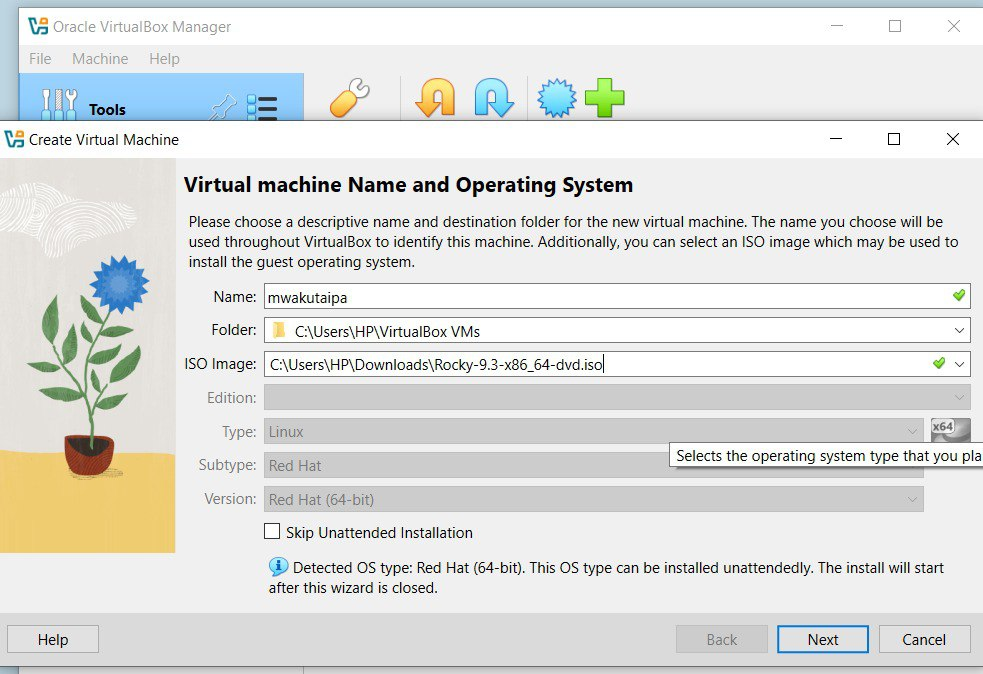{#fig:001 width=70%}

## Настроики

Указываю обьем памяти и создаю виртуальнный жетский диск.

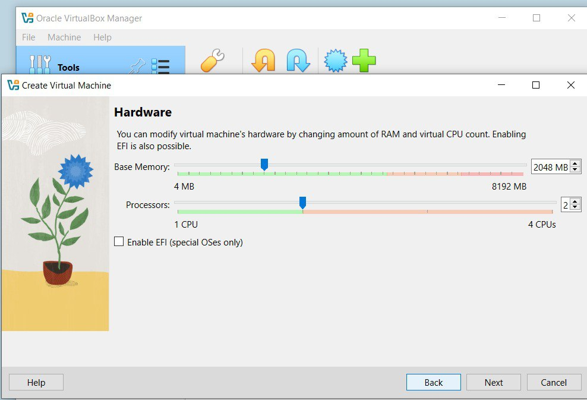{#fig:002 width=70%}

## Настроики

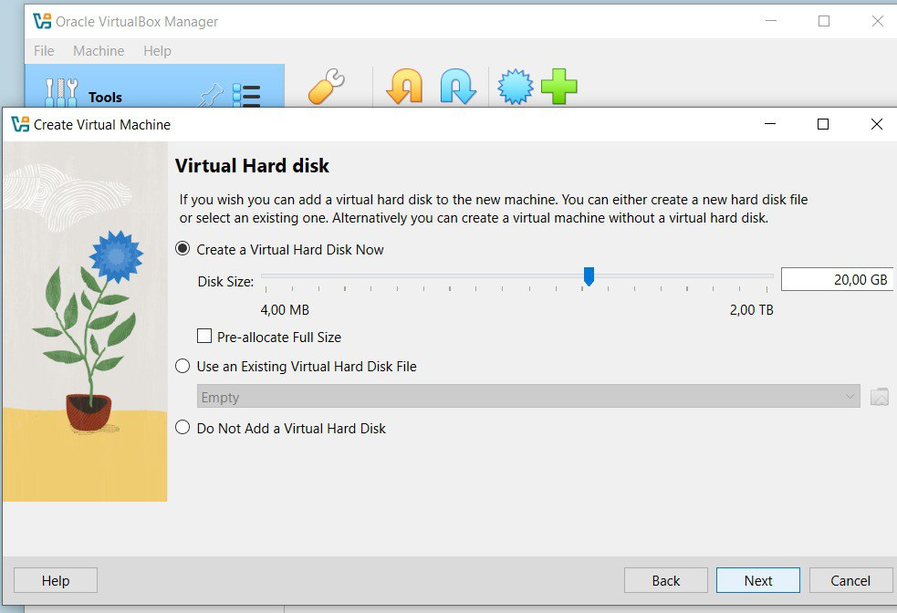{#fig:003 width=70%}

## Настроики

Соглашаюсь с поставленными настройками.

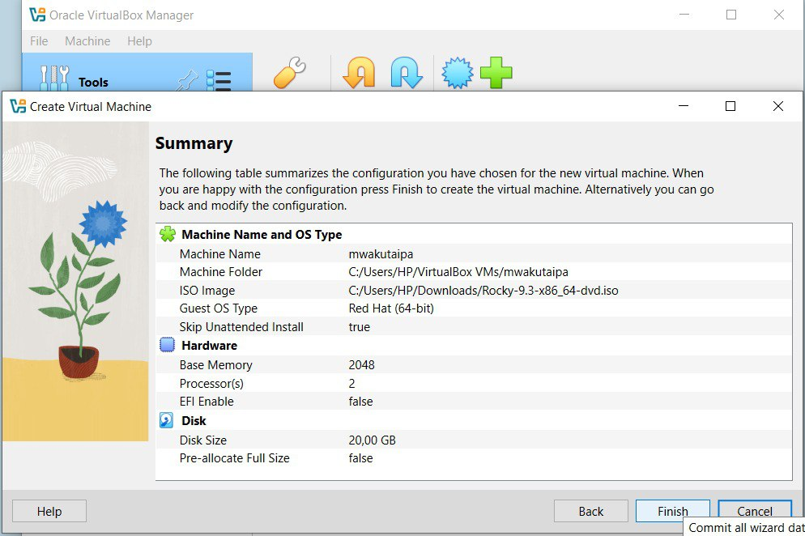{#fig:004 width=70%}

## Настроики

Проверяю подключения диска в носителях образ.

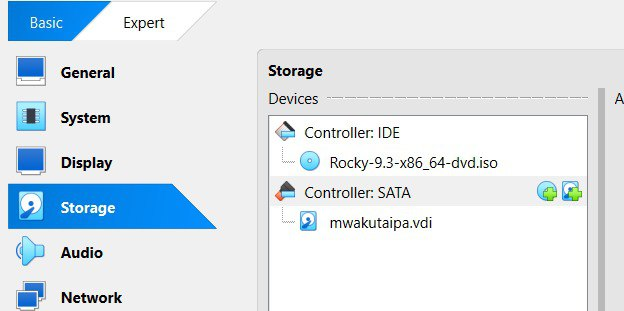{#fig:005 width=70%}

## Настроики

Выбираю место установки, отключаю kdump, создаю пользователя (администратор) и устанавливаю пароль для администратора. 

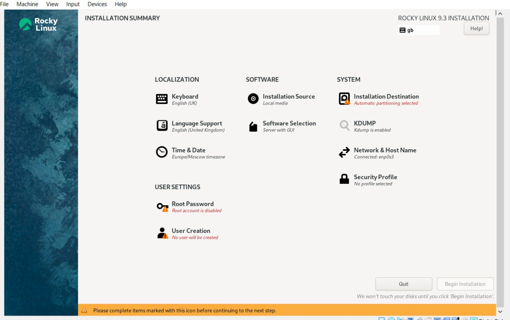{#fig:008 width=70%}

## Настроики

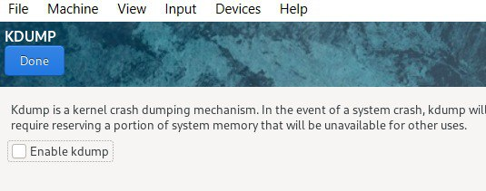{#fig:0011 width=70%}

## Настроики

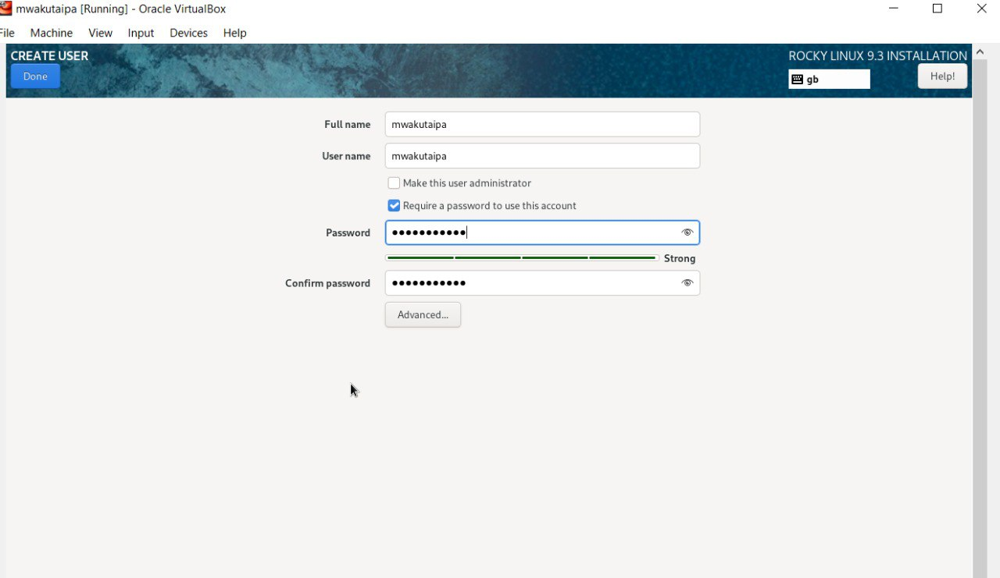{#fig:009 width=70%}

## Настроики

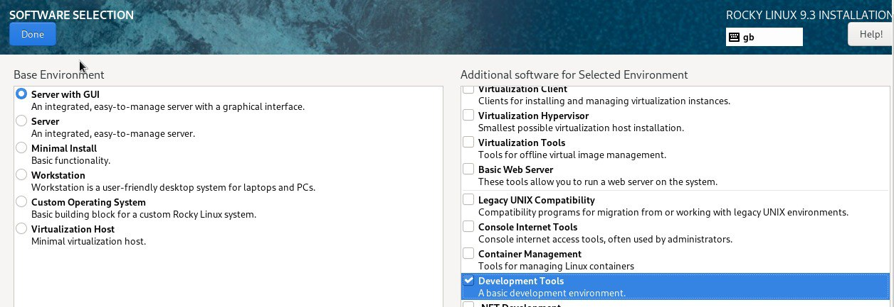{#fig:0010 width=70%}

## Установка

Затем устанавливаю систему.
 
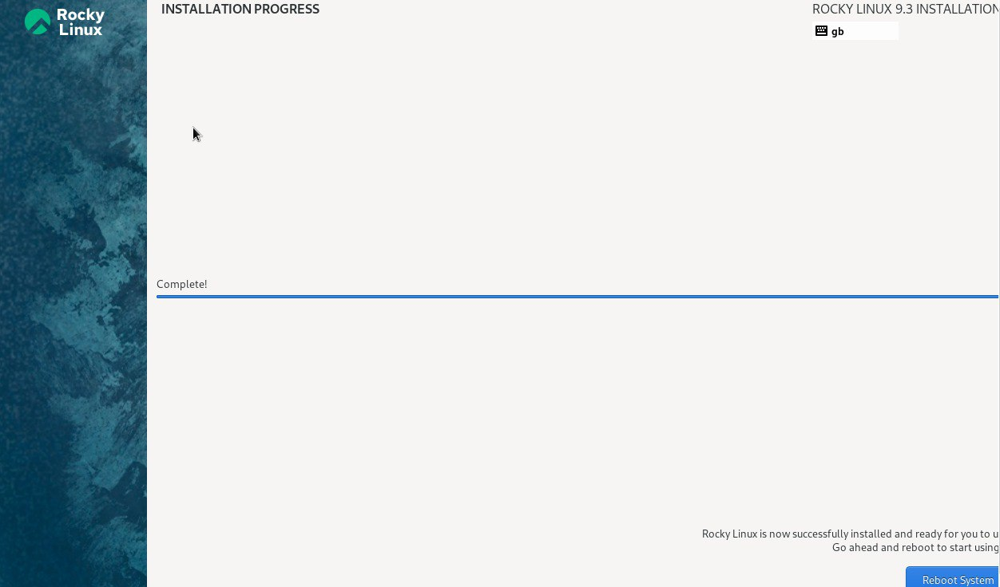{#fig:0013 width=70%}

## Установка

После завершения установки образ диска пропадет из носителей.

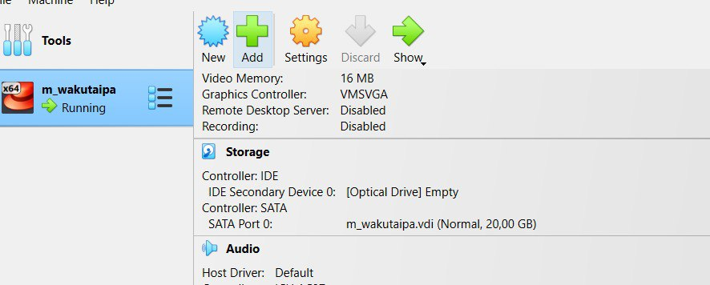{#fig:0014 width=70%}

## Установка

При запуске виртуальной машины появляется окно выбора пользователя.

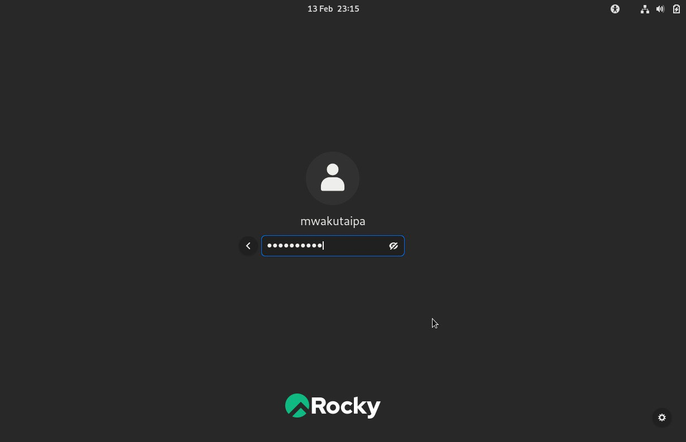{#fig:0015 width=70%}

## Информация о системе

Запускаю в терминале: dmesg | grep -i "Linux version", чтобы получить информацию о ядра.

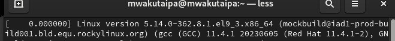{#fig:0017 width=70%}

## Информация о системе

dmesg | grep -i "detected", чтобы получить информацию о процессоре.

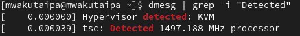{#fig:0018 width=70%}

## Информация о системе

dmesg | grep -i "CPU", чтобы получить информацию о модели процессора.

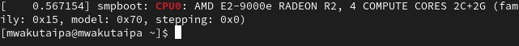{#fig:0019 width=70%}

# Выводы

Я приобрела практические навыки установки операционной системы на виртуальную машину, настройки минимально необходимых для дальнейшей работы сервисов.

