---
## Front matter
lang: ru-RU
title: Презентация по второй лабораторной работе
subtitle: Атрибуты файлов
author:
  - Ваутайпа М.
institute:
  - Российский университет дружбы народов, Москва, Россия
date: 01 марта 2025

## i18n babel
babel-lang: russian
babel-otherlangs: english

## Formatting pdf
toc: false
toc-title: Содержание
slide_level: 2
aspectratio: 169
section-titles: true
theme: metropolis
header-includes:
 - \metroset{progressbar=frametitle,sectionpage=progressbar,numbering=fraction}
---

# Информация

## Докладчик

:::::::::::::: {.columns align=center}
::: {.column width="70%"}

  * Вакутайпа Милдред
  * НКАбд-02-23
  * Факультет физико-математический и естесвенные науки
  * Российский университет дружбы народов
  * [1032239009@rudn.ru](mailto:1032239009@rudn.ru)
  * <https://wakutaipaa.github.io>

:::
::::::::::::::

# Вводная часть

## Цель работы

Получение навыков работы в консоли с атрибутами файлов, закрепление теоретических основ дискреционного разграничения доступав современных системах с открытым кодом на базе ОС Linux.

## Задание

1. Работа с атрибутами  файлов
2. Заполнение таблиц

# Выполнение лабораторной работы

## Атрибуты файлов

Через учетную запись администратора создаю нового пользователя guest и задаю пароль.

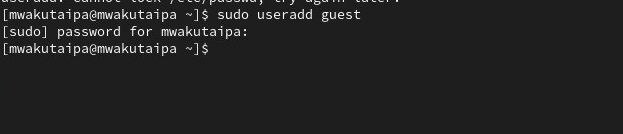{#fig:001 width=70%}

## Атрибуты файлов

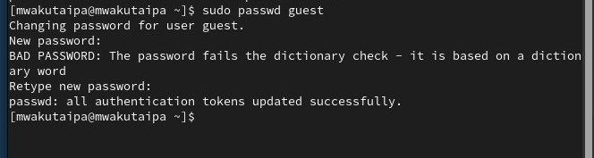{#fig:002 width=70%}

## Атрибуты файлов

Вхожу в системе от имени ползователя guest и определяю, где нахожусь с помощью pwd.

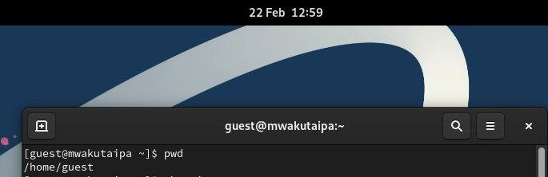{#fig:003 width=70%}

## Атрибуты файлов

Уточняю имя пользователя.

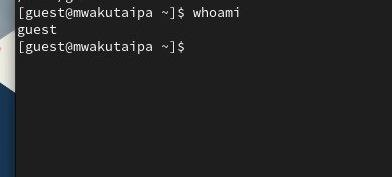{#fig:004 width=70%}

## Атрибуты файлов

Groups выводит информция о названии группы, к которой относится пользователь. id выводит больше информации чем groups (имя пользователя и группыб коды группы и пользователя). 

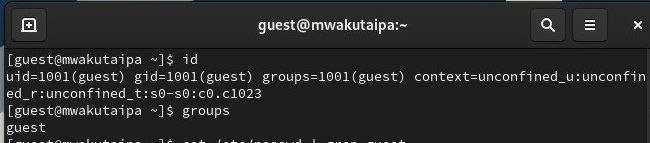{#fig:005 width=70%}

## Атрибуты файлов

С помощью cat /etc/passwd | grep guest вывожу свою учетную запись и адрес домашней директории. 

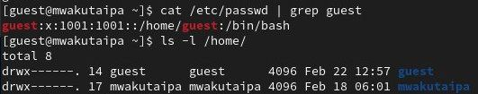{#fig:006 width=70%}

## Атрибуты файлов

список поддиректорий директории home получилось получить с помощью команды ls -l

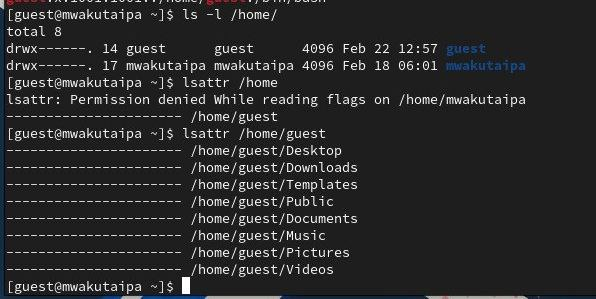{#fig:007 width=70%}

## Атрибуты файлов

Создаю поддиректорию dir1 для домашней директории. Расширенные атрибуты командой lsattr просмотреть у директории не удается, но атрибуты есть: drwxr-xr-x, их удалось просмотреть с помощью команды ls -l

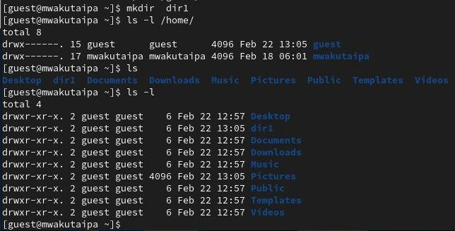{#fig:008 width=70%}

## Атрибуты файлов

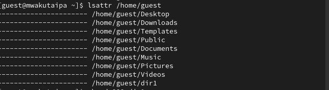{#fig:009 width=70%}

## Атрибуты файлов

Снимаю атрибуты командой chmod 000 dir1, при проверке с помощью команды ls -l видно, что теперь атрибуты действительно сняты.
 
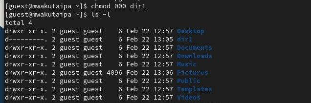{#fig:010 width=70%}

## Атрибуты файлов

Попытка создать файл в директории dir1. Выдает отказано в доступе. Вернув права директории и использовав снова командy ls -l можно убедиться, что файл не был создан.

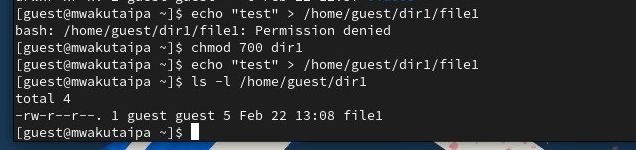{#fig:013 width=70%}

# Выводы

При выполнении проделанной работы я получила практические навыки работы в консоли с атрибутами файлов, закрепление теоретических основ дискреционного разграничения доступав современных системах с открытым кодом на базе ОС Linux.

