---
## Front matter
lang: ru-RU
title: Презентация по лабораторной работе №3
subtitle: Атрибуты файлов
author:
  - Вакутайпа М.
institute:
  - Российский университет дружбы народов, Москва, Россия
date: 16 марта 2025

## i18n babel
babel-lang: russian
babel-otherlangs: english

## Formatting pdf
toc: false
toc-title: Содержание
slide_level: 2
aspectratio: 169
section-titles: true
theme: metropolis
header-includes:
 - \metroset{progressbar=frametitle,sectionpage=progressbar,numbering=fraction}
---

# Информация

## Докладчик

:::::::::::::: {.columns align=center}
::: {.column width="70%"}

  * Вакутайпа Милдред
  * НКАбд-02-23
  * Факультет Физико-математических и естественных наук
  * Российский университет дружбы народов
  * [1032239009@rudn.ru](mailto:1032239009@rudn.ru)
  * <https://wakutaipa.github.io/>

:::
::::::::::::::

# Цель работы

Получить практические навыки работы в консоли с атрибутами файлов дя групп пользоватей.

## Задание

1. Создать пользователя guest2, добавить его в группу пользователей.

# Выполнение лабораторной работы

У меня уже существует пользователь guest, поэтому не повторно создаю его а создаю я guest2 и устанавливаю пароль:

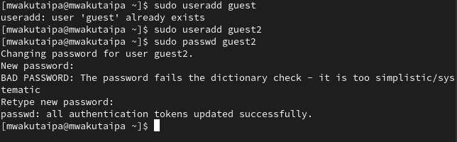{#fig:001 width=70%}

## Добавление в группу

Добавляю guest2 в группу guest:

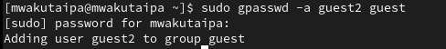{#fig:002 width=70%}

## вход в guest

От имени guest и guest2 захожу на разных консолях используя su:

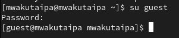{#fig:003 width=70%}

## вход в guest

{#fig:004 width=70%}

## Комманда pwd

С помощью pwd определяю, где нахожусь:

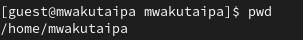{#fig:005 width=70%}

## Комманда pwd 

Текущая директория совпадает с приглашением командной строки: 

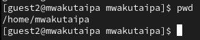{#fig:006 width=70%}

## Проверка guest 

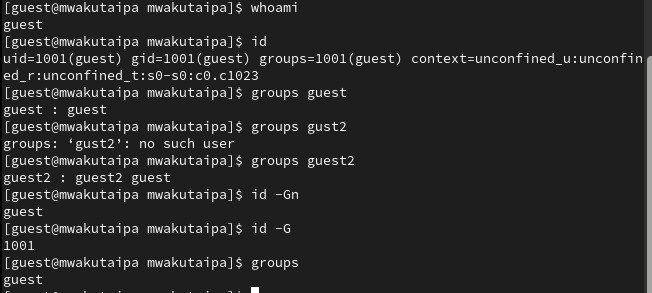{#fig:007 width=70%}

## Проверка guest

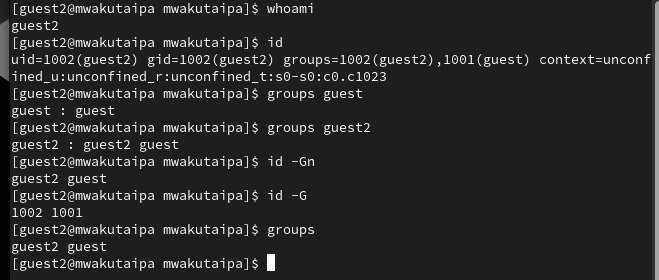{#fig:008 width=70%}

## содержиемое etc/group

Вывела интересующее меня содержимое файла etc/group, видно, что в группе guest два пользователя, а в группе guest2 один:

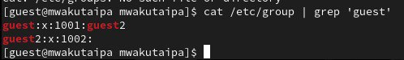{#fig:009 width=70%}

## содержиемое etc/group

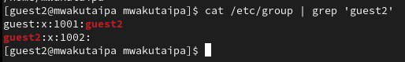{#fig:0010 width=70%}

## создание новой группы

Регистрирую guest2 в группе guest с помощью команды newgrp:

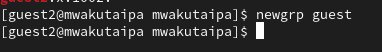{#fig:0011 width=70%}

## вход в /home/guest

Далее добавляю права на читение, запись и исполнение пользователей группы guest:

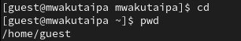{#fig:0012 width=70%}

## Изменение права доступа

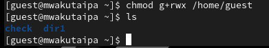{#fig:0013 width=70%}

## Проверка изменения

Потом снимаю все атрибуты с директории dir1, созданной в предыдущей лабораторной работе. Проверяю, что права действительно сняты

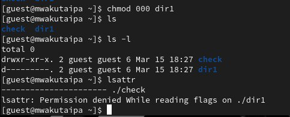{#fig:0014 width=70%}

## Проверка атрибутов 

Далее проверяю как guest2 взаимодействует с файлами dir1 и заполняю таблицы

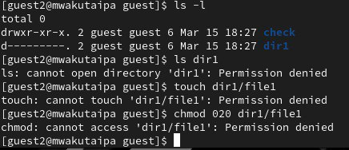{#fig:0015 width=70%}

# Выводы

Получила навыки работы в консоли с атрибутами файлов.
