---
## Front matter
title: "Отчёт по лабораторной работе №3"
subtitle: "Работа с атрибутами файлов"
author: "Вакутаайпа Милдред"

## Generic otions
lang: ru-RU
toc-title: "Содержание"

## Bibliography
bibliography: bib/cite.bib
csl: pandoc/csl/gost-r-7-0-5-2008-numeric.csl

## Pdf output format
toc: true # Table of contents
toc-depth: 2
lof: true # List of figures
lot: true # List of tables
fontsize: 12pt
linestretch: 1.5
papersize: a4
documentclass: scrreprt
## I18n polyglossia
polyglossia-lang:
  name: russian
  options:
	- spelling=modern
	- babelshorthands=true
polyglossia-otherlangs:
  name: english
## I18n babel
babel-lang: russian
babel-otherlangs: english
## Fonts
mainfont: IBM Plex Serif
romanfont: IBM Plex Serif
sansfont: IBM Plex Sans
monofont: IBM Plex Mono
mathfont: STIX Two Math
mainfontoptions: Ligatures=Common,Ligatures=TeX,Scale=0.94
romanfontoptions: Ligatures=Common,Ligatures=TeX,Scale=0.94
sansfontoptions: Ligatures=Common,Ligatures=TeX,Scale=MatchLowercase,Scale=0.94
monofontoptions: Scale=MatchLowercase,Scale=0.94,FakeStretch=0.9
mathfontoptions:
## Biblatex
biblatex: true
biblio-style: "gost-numeric"
biblatexoptions:
  - parentracker=true
  - backend=biber
  - hyperref=auto
  - language=auto
  - autolang=other*
  - citestyle=gost-numeric
## Pandoc-crossref LaTeX customization
figureTitle: "Рис."
tableTitle: "Таблица"
listingTitle: "Листинг"
lofTitle: "Список иллюстраций"
lotTitle: "Список таблиц"
lolTitle: "Листинги"
## Misc options
indent: true
header-includes:
  - \usepackage{indentfirst}
  - \usepackage{float} # keep figures where there are in the text
  - \floatplacement{figure}{H} # keep figures where there are in the text
---

# Цель работы

Получить практические навыки работы в консоли с атрибутами файлов дя групп пользоватей.

# Задание

1. Создать пользователя guest2, добавить его в группу пользователей.
2. Заполнить таблицы

# Выполнение лабораторной работы

У меня уже существует пользователь guest, поэтому не повторно создаю его а создаю я guest2 и устанавливаю пароль:

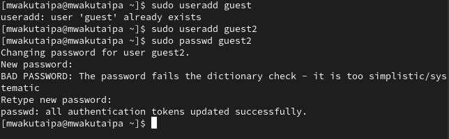{#fig:001 width=70%}

Добавляю guest2 в группу guest:

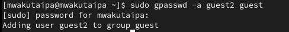{#fig:002 width=70%}

От имени guest и guest2 захожу на разных консолях используя su:

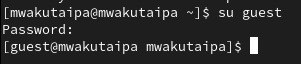{#fig:003 width=70%}

{#fig:004 width=70%}

С помощью pwd определяю, где нахожусь:

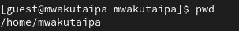{#fig:005 width=70%}

Текущая директория совпадает с приглашением командной строки: 

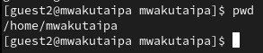{#fig:006 width=70%}

Проверяю имя пользователей с помощью команды whoami. Она выводит группы, которым принадлежит пользователь и коды этих групп (gid). 
Команда groups просто выведет список групп, в которые входит пользователь.
id -Gn - выведет названия групп, которым принадлежит пользователь
id -G - выведет только код групп, которым принадлежит пользователь.

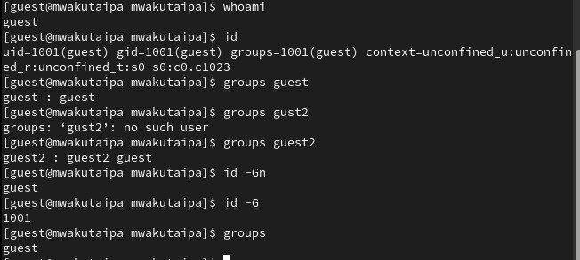{#fig:007 width=70%}

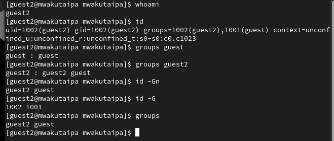{#fig:008 width=70%}

Вывела интересующее меня содержимое файла etc/group, видно, что в группе guest два пользователя, а в группе guest2 один:

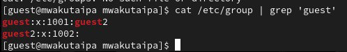{#fig:009 width=70%}

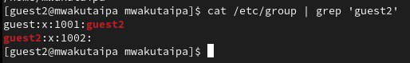{#fig:0010 width=70%}

Регистрирую guest2 в группе guest с помощью команды newgrp:

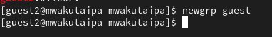{#fig:0011 width=70%}

Далее добавляю права на читение, запись и исполнение пользователей группы guest:

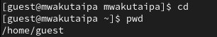{#fig:0012 width=70%}

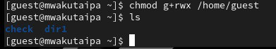{#fig:0013 width=70%}

Потом снимаю все атрибуты с директории dir1, созданной в предыдущей лабораторной работе. Проверяю, что права действительно сняты

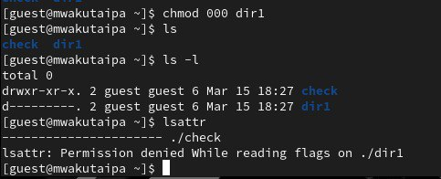{#fig:0014 width=70%}

Далее проверяю как guest2 взаимодействует с файлами dir1 и заполняю таблицы

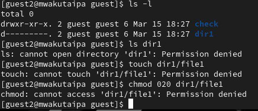{#fig:0015 width=70%}

## Заполнение таблицы

| Права директории | Права файла | Создание файла| Удаление файла | Запись в файл | Чтение файла | Смена директории | Просмотр файлов в директории | Переименование файл | Смена атрибутов файла |
|:---------------------|:---------------------|-----|-----|-----|-----|-----|-----|-----|-----|
|
|
d-----x-— (010)```|```--------— (000)```| - | - | - | - | - | - | - | + |
|
|
d----wx-— (030)```|```--------— (000)```| + | + | - | - | + | - | + | + |
|
|
d---r-x-— (050)```|```--------— (000)```| - | - | - | - | + | + | - | + |
|
|
d---rwx-— (070)```|```--------— (000)```| + | + | - | - | + | + | + | + |
|
|
d-----x-— (010)```|```------x-— (010)```| - | - | - | - | - | - | - | + |
|
|
d----wx-— (030)```|```------x-— (010)```| + | + | - | - | + | - | + | + |
|
|
d---r-x-— (050)```|```------x-— (010)```| - | - | - | - | + | + | - | + |
|
|
d---rwx-— (070)```|```------x-— (010)```| + | + | - | - | + | + | + | + |
|
|
d-----x-— (010)```|```-----w--— (020)```| - | - | + | - | - | - | - | + |
|
|
d----wx-— (030)```|```-----w--— (020)```| + | + | + | - | + | - | + | + |
|
|
d---r-x-— (050)```|```-----w--— (020)```| - | - | + | - | + | + | - | + |
|
|
d---rwx-— (070)```|```-----w--— (020)```| + | + | + | - | + | + | + | + |
|
|
d-----x-— (010)```|```-----wx-— (030)```| - | - | + | - | - | - | - | + |
|
|
d----wx-— (030)```|```-----wx-— (030)```| + | + | + | - | + | - | + | + |
|
|
d---r-x-— (050)```|```-----wx-— (030)```| - | - | + | - | + | + | - | + |
|
|
d---rwx-— (070)```|```-----wx-— (030)```| + | + | + | - | + | + | + | + |
|
|
d-----x-— (010)```|```----r---— (040)```| - | - | - | + | + | - | - | + |
|
|
d----wx-— (030)```|```----r---— (040)```| + | + | - | + | + | - | + | + |
|
|
d---r-x-— (050)```|```----r---— (040)```| - | - | - | + | + | + | - | + |
|
|
d---rwx-— (070)```|```----r---— (040)```| + | + | - | + | + | + | + | + |
|
|
d-----x-— (010)```|```----r-x-— (050)```| - | - | - | + | + | - | - | + |
|
d----w--— (020)
|
----r-x-— (050)
| - | - | - | - | - | - | - | - |

Таблица 3.1 «Установленные права и разрешенные действия для групп»


| Операция | Права на директорию | Права на файл |
|------------------------|---------------------------------|---------------------------|
| Создание файла |
| Удаление файла | 
d----wx-— (030)``` | ```--------— (000)``` |
| Чтение файла |
| Запись в файл | 
d-----x-— (010)``` | ```-----w--— (020)``` |
| Переименование файла |
| Создание поддиректории | 
d----wx-— (030)``` | ```--------— (000)``` |
| Удаление поддиректории | `d----wx-— (030)``` | ```--------— (000)``` |

Таблица 3.2 «Минимальные права для совершения операций от имени пользователей входящих в группу»

# Выводы

Получила навыки работы в консоли с атрибутами файлов.

