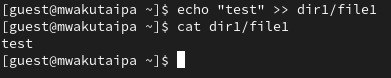

---
## Front matter
lang: ru-RU
title: Презентация по лабораторной работе 4
subtitle: Расширенные атрибуы файлов
author:
  - Вакутайпа М.
institute:
  - Российский университет дружбы народов, Москва, Россия
date: 01 апреля 2025

## i18n babel
babel-lang: russian
babel-otherlangs: english

## Formatting pdf
toc: false
toc-title: Содержание
slide_level: 2
aspectratio: 169
section-titles: true
theme: metropolis
header-includes:
 - \metroset{progressbar=frametitle,sectionpage=progressbar,numbering=fraction}
---

# Информация

## Докладчик

:::::::::::::: {.columns align=center}
::: {.column width="70%"}

  * Вакутайпа Милдред
  * НКА -02-23
  * Факультет физико-математических и естественных наук
  * Российский университет дружбы народов
  * [1032239009@rudn.ru](mailto:1032239009@rudn.ru)
  * <https://wakutaipa.github.io/ru/>

:::
::::::::::::::

# Цель работы

Получить практические навыки по работе в консоли с расширенными атрибутами файлов.

# Выполнение лабораторной работы

## атрибуты file1

От имени пользователья geust определяю расширенные атрибуты файла dir1/file1.

{#fig:001 width=70%}

## chmod 600

Изменяю права доступа для файла с помощью chmmod 600.

{#fig:002 width=70%}

## Устаноавка атрибута без разрешения администратора

Устанавливаю расширенный атрибут от имени пользователя guest и получаю отказ действия в ответе.

{#fig:003 width=70%}

## Устаноавка атрибута с разрешением администратора

Устанавливаю права от имени суперпользователя и получается установить атрибут и проверяю работу с помощью lsattr.

{#fig:004 width=70%}

## Дозапись в file1

Выполняю запись в файл с помощью echo.

{#fig:005 width=70%}

## Удаление file1

Пробую удалить file1 и получаю отказ в ответе. 

{#fig:006 width=70%}

## Попытка переименовать файл

Получаю отказ при попытке переименовать файл. 

{#fig:007 width=70%}

## Изменение права доступа

Когда пытаюсь изменить права доступа также получаю отказ.

{#fig:008 width=70%}

## Снятие атрибут а

Снимаю расширенный атрибут с файла.

{#fig:009 width=70%}

## Проверка файла

Проверяю файл на чтение, переименованиеб изменение прав доступа и выполнение. 

{#fig:010 width=70%}

## Название рисунка

Далее повторяю все проделанные действия но с расширенный атрибут i.

{#fig:011 width=70%}

# Выводы

Получила навыки по работе с расширенными атрибутами файлов.

