---
## Front matter
title: "Отчёт по лабораторной работе №4"
subtitle: "Атрибуты файлов"
author: "Вакутайпа Милдред"

## Generic otions
lang: ru-RU
toc-title: "Содержание"

## Bibliography
bibliography: bib/cite.bib
csl: pandoc/csl/gost-r-7-0-5-2008-numeric.csl

## Pdf output format
toc: true # Table of contents
toc-depth: 2
lof: true # List of figures
lot: true # List of tables
fontsize: 12pt
linestretch: 1.5
papersize: a4
documentclass: scrreprt
## I18n polyglossia
polyglossia-lang:
  name: russian
  options:
	- spelling=modern
	- babelshorthands=true
polyglossia-otherlangs:
  name: english
## I18n babel
babel-lang: russian
babel-otherlangs: english
## Fonts
mainfont: IBM Plex Serif
romanfont: IBM Plex Serif
sansfont: IBM Plex Sans
monofont: IBM Plex Mono
mathfont: STIX Two Math
mainfontoptions: Ligatures=Common,Ligatures=TeX,Scale=0.94
romanfontoptions: Ligatures=Common,Ligatures=TeX,Scale=0.94
sansfontoptions: Ligatures=Common,Ligatures=TeX,Scale=MatchLowercase,Scale=0.94
monofontoptions: Scale=MatchLowercase,Scale=0.94,FakeStretch=0.9
mathfontoptions:
## Biblatex
biblatex: true
biblio-style: "gost-numeric"
biblatexoptions:
  - parentracker=true
  - backend=biber
  - hyperref=auto
  - language=auto
  - autolang=other*
  - citestyle=gost-numeric
## Pandoc-crossref LaTeX customization
figureTitle: "Рис."
lofTitle: "Список иллюстраций"
## Misc options
indent: true
header-includes:
  - \usepackage{indentfirst}
  - \usepackage{float} # keep figures where there are in the text
  - \floatplacement{figure}{H} # keep figures where there are in the text
---

# Цель работы

Получить практические навыки по работе в консоли с расширенными атрибутами файлов.

# Выполнение лабораторной работы

От имени пользователья geust определяю расширенные атрибуты файла dir1/file1.

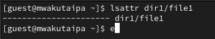{#fig:001 width=70%}

Изменяю права доступа для файла с помощью chmmod 600.

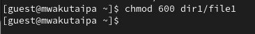{#fig:002 width=70%}

Устанавливаю расширенный атрибут от имени пользователя guest и получаю отказ действия в ответе.

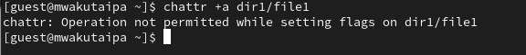{#fig:003 width=70%}

Устанавливаю права от имени суперпользователя и получается установить атрибут и проверяю работу с помощью lsattr.

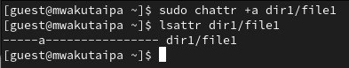{#fig:004 width=70%}

Выполняю запись в файл с помощью echo.

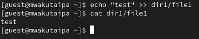{#fig:005 width=70%}

Пробую удалить file1 и получаю отказ в ответе. 

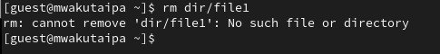{#fig:006 width=70%}

Получаю отказ при попытке переименовать файл. 

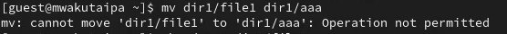{#fig:007 width=70%}

Когда пытаюсь изменить права доступа также получаю отказ.

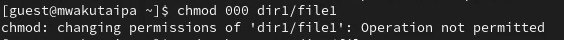{#fig:008 width=70%}

Снимаю расширенный атрибут с файла.

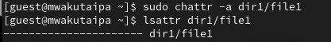{#fig:009 width=70%}

Проверяю файл на чтение, переименованиеб изменение прав доступа и выполнение. 

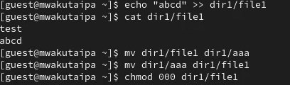{#fig:010 width=70%}

Далее повторяю все проделанные действия но с расширенный атрибут i.

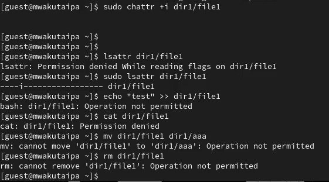{#fig:011 width=70%}

# Выводы

Получила навыки по работе с расширенными атрибутами файлов.

