---
## Front matter
lang: ru-RU
title: Пезентация по пятой лабораторной работе
subtitle: Дискреционное Разграничение Прав в Linux. Исследование Влияния Дополнительных Атрибутов
author:
  - Вакутайпа М.
institute:
  - Российский университет дружбы народов, Москва, Россия
date: 17 апреля 2025

## i18n babel
babel-lang: russian
babel-otherlangs: english

## Formatting pdf
toc: false
toc-title: Содержание
slide_level: 2
aspectratio: 169
section-titles: true
theme: metropolis
header-includes:
 - \metroset{progressbar=frametitle,sectionpage=progressbar,numbering=fraction}
---

# Информация

## Докладчик

:::::::::::::: {.columns align=center}
::: {.column width="70%"}

  * Вакутайпа Милдред
  * НКАбд-02-23
  * Факультет физико-математических и естественных наук
  * Российский университет дружбы народов
  * [1032239009@rudn.ru](mailto:1032239009@rudn.ru)
  * <https://wakutaipa.github.io>
:::
::::::::::::::


# Цель работы

Изучение механизмов изменения идентификатаровб применения SetUID и Sticky-битов. Получение практических навыков работы в консоли с дополнительными атрибутами. Рассмотрение работы механизма смены идентификатора процессов пользователей, а также влияние бита Sticky на запись и удаление файлов. 

# Выполнение лабораторной работы

## Проверка рабочее пространство

До начала работы проверила, что имеется средства разработки:

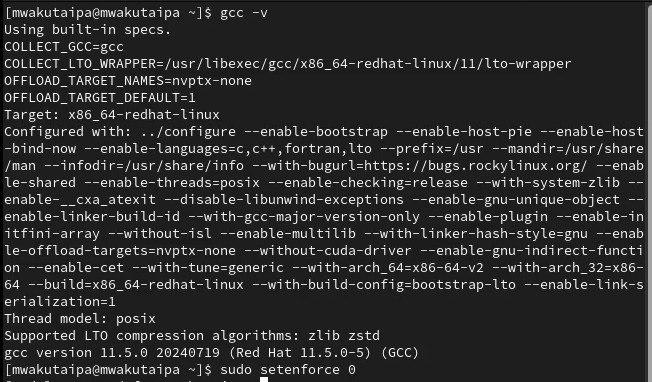{#fig:001 width=70%}

## Создание simpleid.c

Вошла в систему от имени пользователя guest и создала программу simpleid.c:

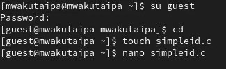{#fig:002 width=70%}

## код программы 1

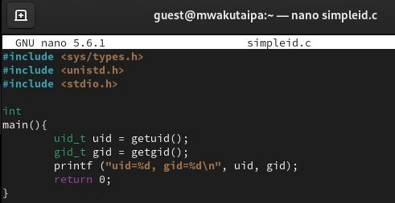{#fig:003 width=70%}

## simpleid.c

Скомпилировала программу и запускаю ее. Она выводит идентификатор пользователя и группы: 

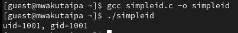{#fig:004 width=70%}

## simpleid2.c

Создала файл simpleid2.c добавив вывод действительных идентификаторов.

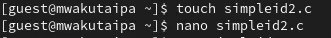{#fig:005 width=70%}

## Вывод simpleid2.c

Скомпилировала программу и запускаю ее.

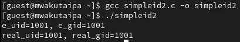{#fig:006 width=70%}

## Изменение права доступа на simpleid2.c

С помощью chown изменяю владельца файла на суперпользователя, с помощью chmod изменяю права доступа

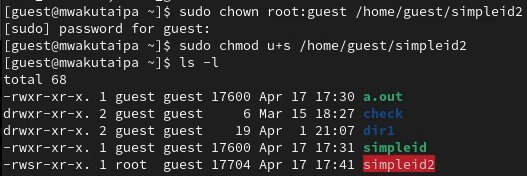{#fig:007 width=70%}

## сравнение simpleid2 на id

Сравнение вывода программы и команды id, наша программа вывела только ограниченное количество информации

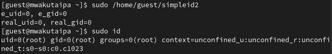{#fig:008 width=70%}

## Программу readfile.c

Создала еще одну программу readfile.c

```C++ листинг 3
int
main (int argc, char* argv[]){
  unsigned char buffer[16];
  size_t bytes_read;
  int i;
  int fd = open (argv[1], O_RDONLY);
  do{
  bytes_read = read (fd, buffer, sizeof (buffer));
  for (i =0; i < bytes_read; ++i) printf("%c", buffer[i]);}
  while (bytes_read == sizeof (buffer));
  close (fd);
  return 0;
}
```

## Программу readfile.c

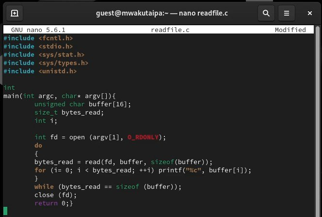{#fig:009 width=70%}

## Смена владельца файла и прав доступа

Снова от имени суперпользователи изменила владельца файла readfile. Далее изменила права доступа так, чтобы пользователь guest не смог прочесть содержимое файла 

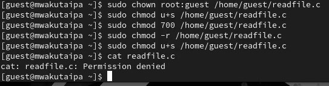{#fig:010 width=70%}

## Попытка прочесть файл

Проверка прочесть файл от имени пользователя guest. Прочесть файл не удается. Попытка прочесть тот же файл с помощью программы readfile, в ответ получаем "отказано в доступе"

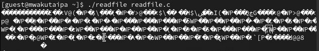{#fig:011 width=70%}

## Попытка 3 прочесть файл

Попытка прочесть файл shadow с помощью программы, все еще получаем отказ в доступе

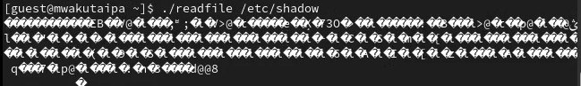{#fig:012 width=70%}

## Чтение файла от суперпользователя

Попробовала прочесть эти же файлы от имени суперпользователя и чтение файлов было успешно

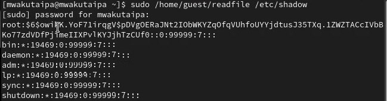{#fig:013 width=70%}

## Создание файла

От имени пользователя guest создаю файл с текстом.

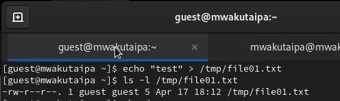{#fig:014 width=70%}

## изменение права доступа

Добавляю права на чтение и запись для других пользователей

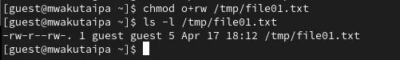{#fig:015 width=70%}

## Проверка файл на чтение, запись и удаление 

Вхожу в систему от имени пользователя guest2, от его имени могу прочитать файл file01.txt, но перезаписать информацию в нем не могу. Также невозможно добавить в файл file01.txt новую информацию от имени пользователя guest2. Когда попробовала удалить файл, снова получила отказ.

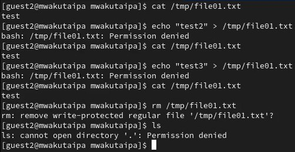{#fig:016 width=70%}

## Снятие атрибута Sticky 

От имени суперпользователя сняла с директории атрибут Sticky.

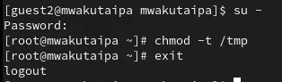{#fig:017 width=70%}

## Повтор предыдущих действий 

Проверила, что атрибут действительно снят и выполнен повтор предыдущих действий. По результатам без Sticky-бита запись в файл и дозапись в файл осталась невозможной

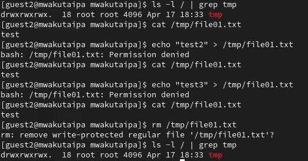{#fig:018 width=70%}

## Изменение атрибутов 

Возвращение директории tmp атрибута t от имени суперпользователя 

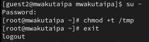{#fig:020 width=70%}

# Выводы

Изучила механизм изменения идентификаторов, применила SetUID- и Sticky-биты. Получила практические навыки работы в консоли с дополнительными атрибутами. Рассмотрела работы механизма смены идентификатора процессов пользователей, а также влияние бита Sticky на запись и удаление файлов.

