---
## Front matter
title: "Отчёт по лабораторной работе №5"
subtitle: "Дискреционное Разграничение Прав в Linux. Исследование Влияния Дополнительных Атрибутов"
author: "Вакутайпа Милдред"

## Generic otions
lang: ru-RU
toc-title: "Содержание"

## Bibliography
bibliography: bib/cite.bib
csl: pandoc/csl/gost-r-7-0-5-2008-numeric.csl

## Pdf output format
toc: true # Table of contents
toc-depth: 2
lof: true # List of figures
lot: true # List of tables
fontsize: 12pt
linestretch: 1.5
papersize: a4
documentclass: scrreprt
## I18n polyglossia
polyglossia-lang:
  name: russian
  options:
	- spelling=modern
	- babelshorthands=true
polyglossia-otherlangs:
  name: english
## I18n babel
babel-lang: russian
babel-otherlangs: english
## Fonts
mainfont: IBM Plex Serif
romanfont: IBM Plex Serif
sansfont: IBM Plex Sans
monofont: IBM Plex Mono
mathfont: STIX Two Math
mainfontoptions: Ligatures=Common,Ligatures=TeX,Scale=0.94
romanfontoptions: Ligatures=Common,Ligatures=TeX,Scale=0.94
sansfontoptions: Ligatures=Common,Ligatures=TeX,Scale=MatchLowercase,Scale=0.94
monofontoptions: Scale=MatchLowercase,Scale=0.94,FakeStretch=0.9
mathfontoptions:
## Biblatex
biblatex: true
biblio-style: "gost-numeric"
biblatexoptions:
  - parentracker=true
  - backend=biber
  - hyperref=auto
  - language=auto
  - autolang=other*
  - citestyle=gost-numeric
## Pandoc-crossref LaTeX customization
figureTitle: "Рис."
tableTitle: "Таблица"
listingTitle: "Листинг"
lofTitle: "Список иллюстраций"
lotTitle: "Список таблиц"
lolTitle: "Листинги"
## Misc options
indent: true
header-includes:
  - \usepackage{indentfirst}
  - \usepackage{float} # keep figures where there are in the text
  - \floatplacement{figure}{H} # keep figures where there are in the text
---

# Цель работы

Изучение механизмов изменения идентификатаровб применения SetUID и Sticky-битов. Получение практических навыков работы в консоли с дополнительными атрибутами. Рассмотрение работы механизма смены идентификатора процессов пользователей, а также влияние бита Sticky на запись и удаление файлов. 

# Выполнение лабораторной работы

До начала работы проверила, что имеется средства разработки:

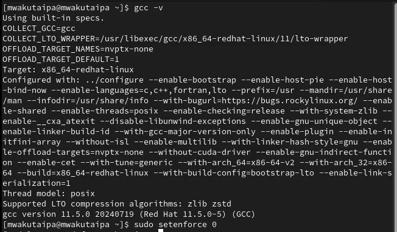{#fig:001 width=70%}

Вошла в систему от имени пользователя guest и создала программу simpleid.c:

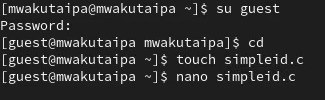{#fig:002 width=70%}

``` C++ листинг 1

#include <sys/types.h>
#include <unistd.h>
#include <stdio.h>

int
main(){
	uid_t uid = getuid();
	gid_t gid = getgid();
	printf("uid=\%d,gid=\%d\\n", uid, gid);
	return 0;
}
```

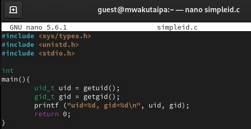{#fig:003 width=70%}

Скомпилировала программу и запускаю ее. Она выводит идентификатор пользователя и группы: 

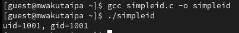{#fig:004 width=70%}

Создала файл simpleid2.c добавив вывод действительных идентификаторов.

``` C++ листинг 2
#include <sys/types.h>
#include <unistd.h>
#include <stdio.h>
int
main ()
{
  uid_t real_uid = getuid ();
  uid_t e_uid = geteuid ();
  gid_t real_gid = getgid ();
  gid_t e_gid = getegid () ;
  printf ("e_uid=\%d,e_gid=\%d\\n", e_uid, e_gid);
  printf ("real_uid=\%d,real_gid=\%d\\n", real_uid, real_gid);
  return 0;
}
```

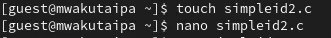{#fig:005 width=70%}

Скомпилировала программу и запускаю ее.

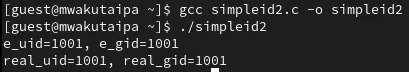{#fig:006 width=70%}

С помощью chown изменяю владельца файла на суперпользователя, с помощью chmod изменяю права доступа

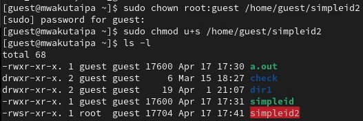{#fig:007 width=70%}

Сравнение вывода программы и команды id, наша программа вывела только ограниченное количество информации

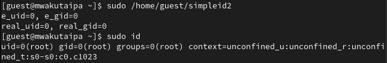{#fig:008 width=70%}

Создала еще одну программу readfile.c

``` C++ листинг 3
#include <fcntl.h>
#include <stdio.h>
#include <sys/stat.h>
#include <sys/types.h>
#include <unistd.h>
int
main (int argc, char* argv[]){
  unsigned char buffer[16];
  size_t bytes_read;
  int i;
  int fd = open (argv[1], O_RDONLY);
  do{
  bytes_read = read (fd, buffer, sizeof (buffer));
  for (i =0; i < bytes_read; ++i) printf("%c", buffer[i]);
  }
  while (bytes_read == sizeof (buffer));
  close (fd);
  return 0;
}
```

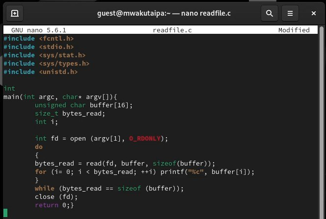{#fig:009 width=70%}

Снова от имени суперпользователи изменила владельца файла readfile. Далее изменила права доступа так, чтобы пользователь guest не смог прочесть содержимое файла 

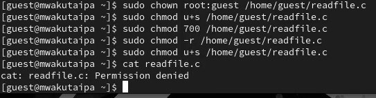{#fig:010 width=70%}

Проверка прочесть файл от имени пользователя guest. Прочесть файл не удается. Попытка прочесть тот же файл с помощью программы readfile, в ответ получаем "отказано в доступе"

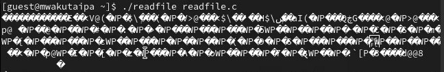{#fig:011 width=70%}

Попытка прочесть файл shadow с помощью программы, все еще получаем отказ в доступе

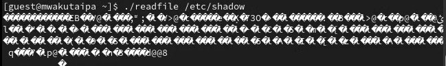{#fig:012 width=70%}

Попробовала прочесть эти же файлы от имени суперпользователя и чтение файлов было успешно

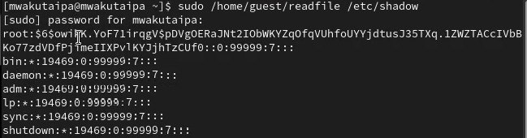{#fig:013 width=70%}

От имени пользователя guest создаю файл с текстом.

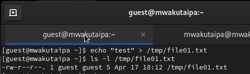{#fig:014 width=70%}

Добавляю права на чтение и запись для других пользователей

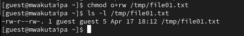{#fig:015 width=70%}

Вхожу в систему от имени пользователя guest2, от его имени могу прочитать файл file01.txt, но перезаписать информацию в нем не могу. Также невозможно добавить в файл file01.txt новую информацию от имени пользователя guest2. Когда попробовала удалить файл, снова получила отказ.

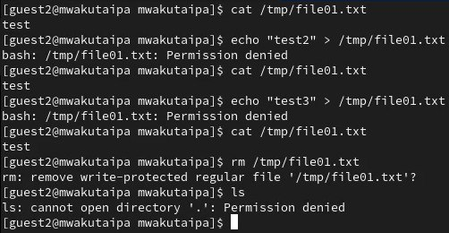{#fig:016 width=70%}

От имени суперпользователя сняла с директории атрибут Sticky.

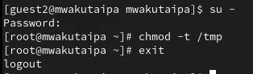{#fig:017 width=70%}

Проверила, что атрибут действительно снят и выполнен повтор предыдущих действий. По результатам без Sticky-бита запись в файл и дозапись в файл осталась невозможной

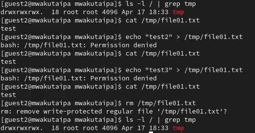{#fig:018 width=70%}

Возвращение директории tmp атрибута t от имени суперпользователя 

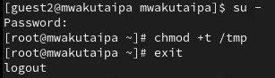{#fig:020 width=70%}

# Выводы

Изучила механизм изменения идентификаторов, применила SetUID- и Sticky-биты. Получила практические навыки работы в консоли с дополнительными атрибутами. Рассмотрела работы механизма смены идентификатора процессов пользователей, а также влияние бита Sticky на запись и удаление файлов.

# Список литературы{.unnumbered}

::: {#refs}
:::
