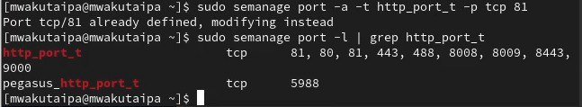

---
## Front matter
lang: ru-RU
title: Презентация по лабораторной работе №6
subtitle: SELinux. Apache
author:
  - Вакутайпа М.
institute:
  - Российский университет дружбы народов, Москва, Россия
date: 01 мая 2025

## i18n babel
babel-lang: russian
babel-otherlangs: english

## Formatting pdf
toc: false
toc-title: Содержание
slide_level: 2
aspectratio: 169
section-titles: true
theme: metropolis
header-includes:
 - \metroset{progressbar=frametitle,sectionpage=progressbar,numbering=fraction}
---

# Информация

## Докладчик

:::::::::::::: {.columns align=center}
::: {.column width="70%"}

  * Вактайпа Милдред
  * НКАбд-02-23
  * Факультет физмко-математических и естесвенных наук
  * Российский университет дружбы народов
  * [1032239009@rudn.ru](mailto:1032239009@rudn.ru)
  * <https://wakutaipa.github.io>

:::
::::::::::::::

# Цель работы

Развить навыки администрирования ОС linux. Получить практическое знакомство с SELinux1. Проверить работу SELinux на практике совместно с веб-сервером Apache.

# Выполнение лабораторной работы

## проверка режима работы SELinux

Вошла в систему под своей учетной записью. Убедилась, что SELinux работает в режиме enforcing политики targeted с помощью getenforce и sestatus 

{#fig:001 width=70%}

## Проверка работы Apache

Запускаю сервер apache, далее обращаюсь с помощью браузера к веб-серверу, запущенному на компьютере, он работает, что видно из вывода команды service httpd status 

{#fig:002 width=70%}

## Контекст безопасности Apache

С помощью команды ps auxZ | grep httpd нашла веб-сервер Apache в списке процессов. Его контекст безопасности - httpd_t 

{#fig:003 width=70%}

## Состояние переключателей SELinux

Просмотрела текущее состояние переключателей SELinux для Apache 

{#fig:004 width=70%}

## Cтатистика по политике

Просмотрела статистику по политике с помощью команды seinfo. Множество пользователей - 8, ролей - 39, типов - 5135. 

{#fig:005 width=70%}

## Типы поддиректорий

Типы поддиректорий, находящихся в директории /var/www, владелец - root, права на изменения только у владельца. Файлов в директории нет 

{#fig:006 width=70%}

## Типы файлов

В директории /var/www/html нет файлов. 

{#fig:007 width=70%}

## Создание файла

Создать файл может только суперпользователь, поэтому от его имени создаем файл touch.html cо следующим содержанием:

```

<html>
<body>test</body>
</html>

```

## Контекст файла

Проверяю контекст созданного файла. По умолчанию это httpd_sys_content_t.

{#fig:009 width=70%}

## Отображение файла

Обращаюсь к файлу через веб-сервер, введя в браузере адрес http://127.0.0.1/test.html. Файл был успешно отображён.

{#fig:010 width=70%}

## Изучение справки по команде

Изучила справку man httpd_selinux. 

{#fig:011 width=70%}

## Изменение контекста

Изменяю контекст файла test.html с httpd_sys_content_t на любой другой, к которому процесс httpd не должен иметь доступа. Контекст действительно поменялся.

{#fig:012 width=70%}

## Отображение файла

При попытке отображения файла в браузере получаем сообщение об ошибке.

{#fig:013 width=70%}

## Попытка прочесть лог-файл

файл не был отображён, хотя права доступа позволяют читать этот файл любому пользователю, потому что установлен контекст, к которому процесс httpd не должен иметь доступа.

{#fig:014 width=70%}

## Изменение файла

Чтобы запустить веб-сервер Apache на прослушивание ТСР-порта 81 (а не 80, как рекомендует IANA и прописано в /etc/services) открываю файл /etc/httpd/httpd.conf для изменения. Нахожу строчку Listen 80 и заменяю её на Listen 81. 

{#fig:015 width=70%}

## Попытка прослушивания другого порта

Выполняю перезапуск веб-сервера Apache. Произошёл сбой, потому что порт 80 для локальной сети, а 81 нет.

{#fig:017 width=70%}

## Проверка лог-файлов

Проанализировала лог-файлы: tail -nl /var/log/messages

{#fig:018 width=70%}

## Проверка лог-файлов

Запись появилась в файлу error_log.

{#fig:019 width=70%}

## Проверка портов

Выполняю команду semanage port -a -t http_port_t -р tcp 81. После этого проверяю список портов командой
semanage port -l | grep http_port_t. Порт 81 появился в списке 

{#fig:020 width=70%}

## Перезапуск сервера

Перезапускаю сервер Apache 

{#fig:021 width=70%}

## Проверка порта 81

Теперь он работает, ведь мы внесли порт 81 в список портов htttpd_port_t. Возвращаю в файле /etc/httpd/httpd.conf порт 80, вместо 81. Проверяю, что порт 81 удален, это правда. 

{#fig:023 width=70%}

## Удаление файла

Далее удаляю файл test.html, проверяю, что он удален

{#fig:024 width=70%}

# Выводы

При выполнении данной лабораторной работы были развиты навыки администрирования ОС Linux, получено первое практическое знакомство с технологией SELinux и проверена работа SELinux на практике совместно с веб-сервером
Apache.

