---
## Front matter
title: "Отчет по лабораторной работе №6"
subtitle: "Администрирование ОС Linux. SELinux"
author: "Вакутайпа Милдред"

## Generic otions
lang: ru-RU
toc-title: "Содержание"

## Bibliography
bibliography: bib/cite.bib
csl: pandoc/csl/gost-r-7-0-5-2008-numeric.csl

## Pdf output format
toc: true # Table of contents
toc-depth: 2
lof: true # List of figures
lot: true # List of tables
fontsize: 12pt
linestretch: 1.5
papersize: a4
documentclass: scrreprt
## I18n polyglossia
polyglossia-lang:
  name: russian
  options:
	- spelling=modern
	- babelshorthands=true
polyglossia-otherlangs:
  name: english
## I18n babel
babel-lang: russian
babel-otherlangs: english
## Fonts
mainfont: IBM Plex Serif
romanfont: IBM Plex Serif
sansfont: IBM Plex Sans
monofont: IBM Plex Mono
mathfont: STIX Two Math
mainfontoptions: Ligatures=Common,Ligatures=TeX,Scale=0.94
romanfontoptions: Ligatures=Common,Ligatures=TeX,Scale=0.94
sansfontoptions: Ligatures=Common,Ligatures=TeX,Scale=MatchLowercase,Scale=0.94
monofontoptions: Scale=MatchLowercase,Scale=0.94,FakeStretch=0.9
mathfontoptions:
## Biblatex
biblatex: true
biblio-style: "gost-numeric"
biblatexoptions:
  - parentracker=true
  - backend=biber
  - hyperref=auto
  - language=auto
  - autolang=other*
  - citestyle=gost-numeric
## Pandoc-crossref LaTeX customization
figureTitle: "Рис."
tableTitle: "Таблица"
listingTitle: "Листинг"
lofTitle: "Список иллюстраций"
lotTitle: "Список таблиц"
lolTitle: "Листинги"
## Misc options
indent: true
header-includes:
  - \usepackage{indentfirst}
  - \usepackage{float} # keep figures where there are in the text
  - \floatplacement{figure}{H} # keep figures where there are in the text
---

# Цель работы

Развить навыки администрирования ОС linux. Получить практическое знакомство с SELinux1. Проверить работу SELinux на практике совместно с веб-сервером Apache.

# Выполнение лабораторной работы

Вошла в систему под своей учетной записью. Убедилась, что SELinux работает в режиме enforcing политики targeted с помощью getenforce и sestatus 

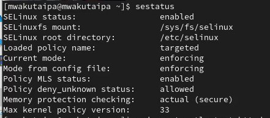{#fig:001 width=70%}

Запускаю сервер apache, далее обращаюсь с помощью браузера к веб-серверу, запущенному на компьютере, он работает, что видно из вывода команды service httpd status 

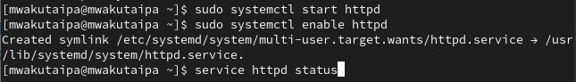{#fig:002 width=70%}

С помощью команды ps auxZ | grep httpd нашла веб-сервер Apache в списке процессов. Его контекст безопасности - httpd_t 

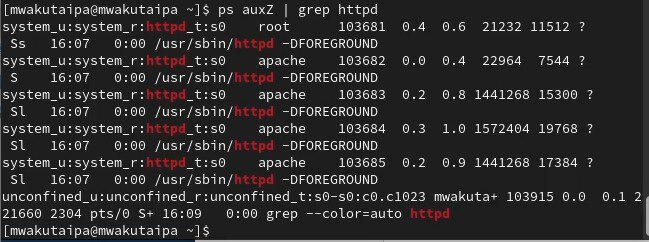{#fig:003 width=70%}

Просмотрела текущее состояние переключателей SELinux для Apache 

{#fig:004 width=70%}

Просмотрела статистику по политике с помощью команды seinfo. Множество пользователей - 8, ролей - 39, типов - 5135. 

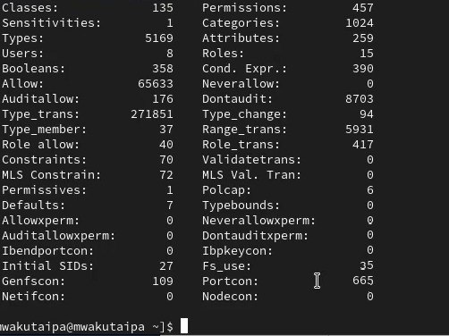{#fig:005 width=70%}

Типы поддиректорий, находящихся в директории /var/www, с помощью команды ls -lZ /var/www следующие: владелец - root, права на изменения только у владельца. Файлов в директории нет 

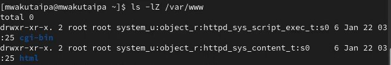{#fig:006 width=70%}

В директории /var/www/html нет файлов. 

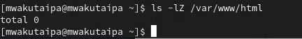{#fig:007 width=70%}

Создать файл может только суперпользователь, поэтому от его имени создаем файл touch.html cо следующим содержанием:

```

<html>
<body>test</body>
</html>

```

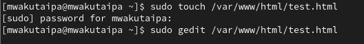{#fig:008 width=70%}

Проверяю контекст созданного файла. По умолчанию это httpd_sys_content_t.

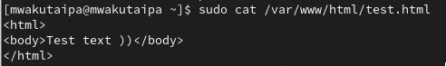{#fig:009 width=70%}

Обращаюсь к файлу через веб-сервер, введя в браузере адрес http://127.0.0.1/test.html. Файл был успешно отображён.

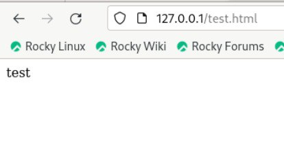{#fig:010 width=70%}

Изучила справку man httpd_selinux. Рассмотрим полученный контекст детально. Так как по умолчанию пользователи CentOS являются свободными от типа (unconfined в переводе с англ. означает свободный), созданному нами
файлу test.html был сопоставлен SELinux, пользователь unconfined_u. Это первая часть контекста.
Далее политика ролевого разделения доступа RBAC используется процессами, но не файлами, поэтому роли не имеют никакого значения для файлов. Роль object_r используется по умолчанию для файлов на «постоянных» носителях и на сетевых файловых системах. (В директории/ргос файлы, относящиеся к процессам, могут иметь роль system_r.
Если активна политика MLS, то могут использоваться и другие роли. Данный случай мы рассматривать не будем, как и предназначение :s0).
Тип httpd_sys_content_t позволяет процессу httpd получить доступ к файлу. Благодаря наличию последнего типа мы получили доступ к файлу при обращении к нему через браузер.

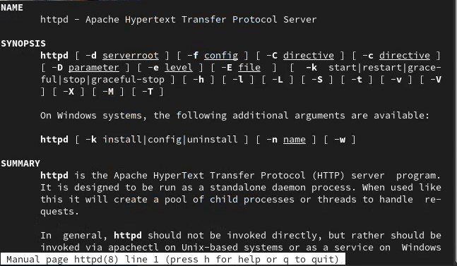{#fig:011 width=70%}

Изменяю контекст файла test.html с httpd_sys_content_t на любой другой, к которому процесс httpd не должен иметь доступа, например, на samba_share_t: chcon -t samba_share_t /var/www/html/test.html ls -Z /var/www/html/test.html. Контекст действительно поменялся.

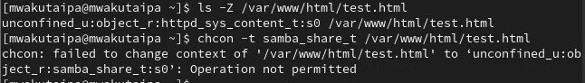{#fig:012 width=70%}

При попытке отображения файла в браузере получаем сообщение об ошибке.

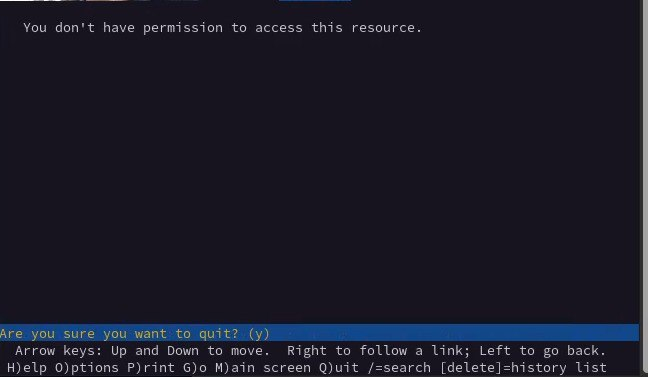{#fig:013 width=70%}

файл не был отображён, хотя права доступа позволяют читать этот файл любому пользователю, потому что установлен контекст, к которому процесс httpd не должен иметь доступа.
Просматриваю log-файлы веб-сервера Apache и системный лог-файл: tail /var/log/messages. Если в системе окажутся запущенными процессы setroubleshootd и audtd, то вы также сможете увидеть ошибки, аналогичные указанным выше, в файле /var/log/audit/audit.log.

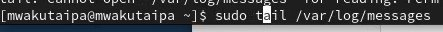{#fig:014 width=70%}

Чтобы запустить веб-сервер Apache на прослушивание ТСР-порта 81 (а не 80, как рекомендует IANA и прописано в /etc/services) открываю файл /etc/httpd/httpd.conf для изменения. Нахожу строчку Listen 80 и заменяю её на Listen 81. 

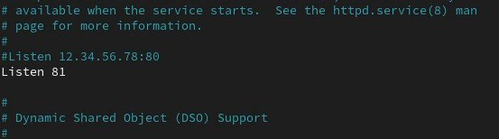{#fig:015 width=70%}


Выполняю перезапуск веб-сервера Apache. Произошёл сбой, потому что порт 80 для локальной сети, а 81 нет.

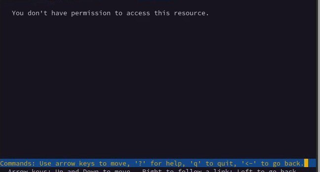{#fig:017 width=70%}

Проанализировала лог-файлы: tail -nl /var/log/messages

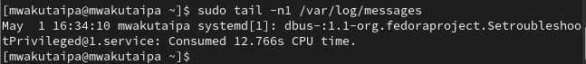{#fig:018 width=70%}

Запись появилась в файлу error_log.

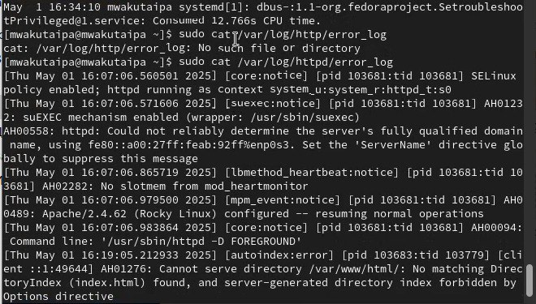{#fig:019 width=70%}

Выполняю команду semanage port -a -t http_port_t -р tcp 81. После этого проверяю список портов командой
semanage port -l | grep http_port_t. Порт 81 появился в списке 

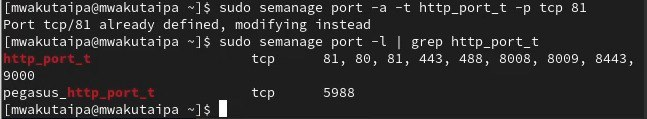{#fig:020 width=70%}

Перезапускаю сервер Apache 

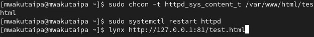{#fig:021 width=70%}

Теперь он работает, ведь мы внесли порт 81 в список портов htttpd_port_t. Возвращаю в файле /etc/httpd/httpd.conf порт 80, вместо 81. Проверяю, что порт 81 удален, это правда. 

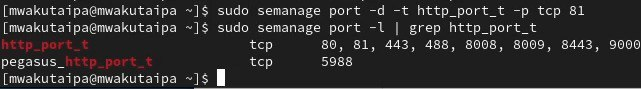{#fig:023 width=70%}

Далее удаляю файл test.html, проверяю, что он удален

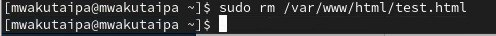{#fig:024 width=70%}

# Выводы

При выполнении данной лабораторной работы были развиты навыки администрирования ОС Linux, получено первое практическое знакомство с технологией SELinux и проверена работа SELinux на практике совместно с веб-сервером
Apache.

# Список литературы{.unnumbered}

::: {#refs}
:::
