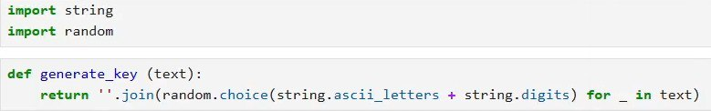
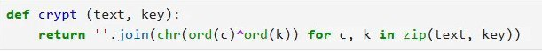
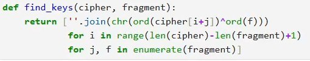
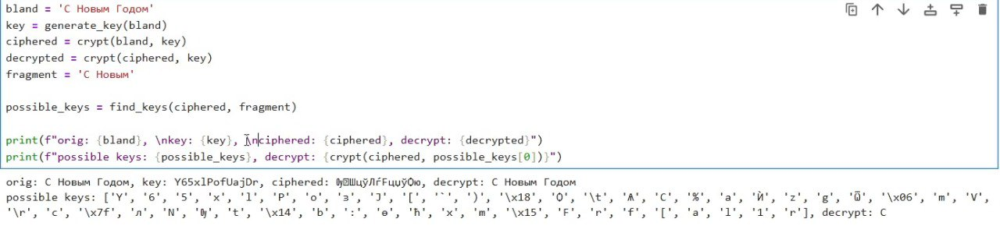

---
## Front matter
lang: ru-RU
title: Презентация по Лабораторной работе №7
subtitle: Режим Однократного Гаммирования
author:
  - Вакутайпа М.
institute:
  - Российский университет дружбы народов, Москва, Россия
date: 16 мая 2025

## i18n babel
babel-lang: russian
babel-otherlangs: english

## Formatting pdf
toc: false
toc-title: Содержание
slide_level: 2
aspectratio: 169
section-titles: true
theme: metropolis
header-includes:
 - \metroset{progressbar=frametitle,sectionpage=progressbar,numbering=fraction}
---

# Информация

## Докладчик

:::::::::::::: {.columns align=center}
::: {.column width="70%"}

  * Вакутайпа Милдред
  * НКАбд 02-23
  * Факультет Физико-математических и Естественных Наук
  * Российский университет дружбы народов
  * [1032239009@rudn.ru](mailto:1032239009@rudn.ru)
  * <https://wakutaipa.github.io>

:::
::::::::::::::

# Цель работы

Научиться применять режим однократного гарммирования.

# Задание

Подобрать ключ, чтобы получить сообщение "С Новым Годом". Требуется разработать приложение, позволяющее шифровать и дешифровать данные в режиме однократного гаммирования.

# Выполнение лабораторной работы

## Функция для генерации ключа

На языке программирования python, создала функцию для генерации случайного ключа.

{#fig:001 width=70%}

## Функция для шифрования и дешифрования 

Делала одну функцию для шифрования и дешифрования текста.

{#fig:002 width=70%}

## функция для нахождения возможных ключей

Нужно определить ключ, с помощью которого шифротекст может быть преобразован в некоторый фрагмент текста. Для этого создала функцию для нахождения возможных ключей для фрагмента текста.

{#fig:003 width=70%}

## Проверка

Далее проверила работы программы. Шифрирование и дешифрирование происходит верно, как и нахождение ключей, с помощью которых можно расшифрировать верно кусок текста. 

{#fig:004 width=70%}

# Спасибо За Внимание

Спасибо За Внимание
