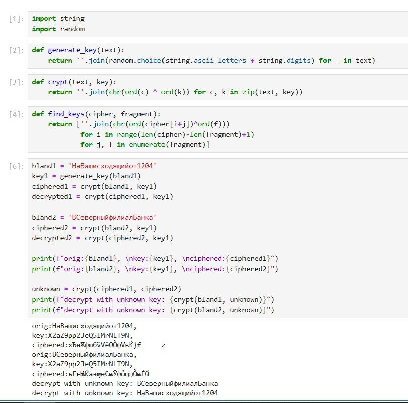

---
## Front matter
lang: ru-RU
title: Презентация по лабораторной работе №8
subtitle: Режим однократного гармонирования
author:
  - Вактайпа М.
institute:
  - Российский университет дружбы народов, Москва, Россия
date: 30 мая 2025

## i18n babel
babel-lang: russian
babel-otherlangs: english

## Formatting pdf
toc: false
toc-title: Содержание
slide_level: 2
aspectratio: 169
section-titles: true
theme: metropolis
header-includes:
 - \metroset{progressbar=frametitle,sectionpage=progressbar,numbering=fraction}
---

# Информация

## Докладчик

:::::::::::::: {.columns align=center}
::: {.column width="70%"}

  * Вакутайпа Милдред
  * НКА 02-23
  * Факультет физико-математических и естественных наук
  * Российский университет дружбы народов
  * [1032239009@rudn.ru](mailto:1032239009@rudn.ru)
  * <https://wakutaipa.github.io>

:::
::::::::::::::

# Цель работы

Освоить на практике применение режим однократного гаммирования на примере кодирования различных исходных текстов одним ключом.

# Выполнение лабораторной работы

## Расшифрированные тексты

В данной работе два текста кодируются одним ключом. Требуется почитать оба текста не зная ключа. 

{#fig:001 width=70%}

## Расшифрированные тексты

Листинг программы 1 

``` python

bland1 = 'НаВашисходящийот1204'
key1 = generate_key(bland1)
ciphered1 = crypt(bland1, key1)
decrypted1 = crypt(ciphered1, key1)

bland2 = 'ВСеверныйфилиалБанка'
ciphered2 = crypt(bland2, key1)
decrypted2 = crypt(ciphered2, key1)

print(f"orig:{bland1}, \nkey:{key1}, \nciphered:{ciphered1}")
print(f"orig:{bland2}, \nkey:{key1}, \nciphered:{ciphered2}")

unknown = crypt(ciphered1, ciphered2)
print(f"decrypt with unknown key: {crypt(bland1, unknown)}")
print(f"decrypt with unknown key: {crypt(bland2, unknown)}")

```

# Выводы

При выполнение данной работыб я освоила на практике применение режим однократного гаммирования на примере кодирования различных исходных текстов одним ключом.

