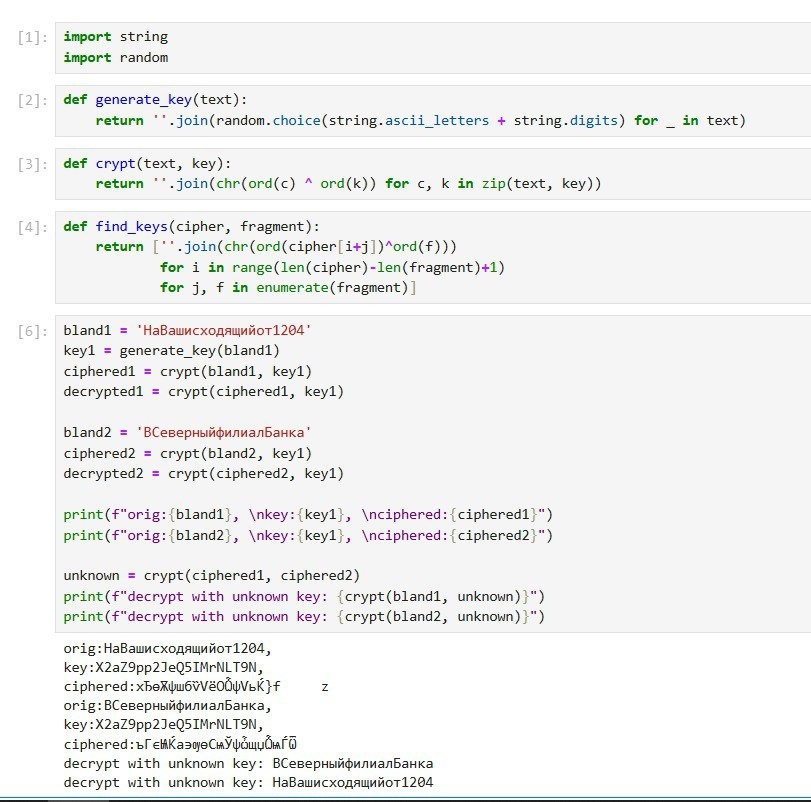

---
## Front matter
title: "Отчёт по лабораторной работе №8"
subtitle: "Режим однократного гаммирования"
author: "Вакутайпа Милдред"

## Generic otions
lang: ru-RU
toc-title: "Содержание"

## Bibliography
bibliography: bib/cite.bib
csl: pandoc/csl/gost-r-7-0-5-2008-numeric.csl

## Pdf output format
toc: true # Table of contents
toc-depth: 2
lof: true # List of figures
lot: true # List of tables
fontsize: 12pt
linestretch: 1.5
papersize: a4
documentclass: scrreprt
## I18n polyglossia
polyglossia-lang:
  name: russian
  options:
	- spelling=modern
	- babelshorthands=true
polyglossia-otherlangs:
  name: english
## I18n babel
babel-lang: russian
babel-otherlangs: english
## Fonts
mainfont: IBM Plex Serif
romanfont: IBM Plex Serif
sansfont: IBM Plex Sans
monofont: IBM Plex Mono
mathfont: STIX Two Math
mainfontoptions: Ligatures=Common,Ligatures=TeX,Scale=0.94
romanfontoptions: Ligatures=Common,Ligatures=TeX,Scale=0.94
sansfontoptions: Ligatures=Common,Ligatures=TeX,Scale=MatchLowercase,Scale=0.94
monofontoptions: Scale=MatchLowercase,Scale=0.94,FakeStretch=0.9
mathfontoptions:
## Biblatex
biblatex: true
biblio-style: "gost-numeric"
biblatexoptions:
  - parentracker=true
  - backend=biber
  - hyperref=auto
  - language=auto
  - autolang=other*
  - citestyle=gost-numeric
## Pandoc-crossref LaTeX customization
figureTitle: "Рис."
tableTitle: "Таблица"
listingTitle: "Листинг"
lofTitle: "Список иллюстраций"
lotTitle: "Список таблиц"
lolTitle: "Листинги"
## Misc options
indent: true
header-includes:
  - \usepackage{indentfirst}
  - \usepackage{float} # keep figures where there are in the text
  - \floatplacement{figure}{H} # keep figures where there are in the text
---

# Цель работы

Освоить на практике применение режим однократного гаммирования на примере кодирования различных исходных текстов одним ключом.

# Выполнение лабораторной работы

В данной работе два текста кодируются одним ключом. Требуется почитать оба текста не зная ключа. Используя код с лабораторной работе №7, генерирую ключ и шифрирую два разных текста одним и тем же ключом. Расшифровываю оба текста с одного ключа, потом предполагаю что ключ неизвестен но известен один текст и расшифровываю второй, зная первый текст и шифротексты.  

{#fig:001 width=70%}

Листинг программы 1 

``` python

import string
import random

def generate_key(text):
    return ''.join(random.choice(string.ascii_letters + string.digits) for _ in text)
    
def crypt(text, key):
    return ''.join(chr(ord(c) ^ ord(k)) for c, k in zip(text, key))
    
def find_keys(cipher, fragment):
    return [''.join(chr(ord(cipher[i+j])^ord(f)))
            for i in range(len(cipher)-len(fragment)+1)
            for j, f in enumerate(fragment)]
            
            
bland1 = 'НаВашисходящийот1204'
key1 = generate_key(bland1)
ciphered1 = crypt(bland1, key1)
decrypted1 = crypt(ciphered1, key1)

bland2 = 'ВСеверныйфилиалБанка'
ciphered2 = crypt(bland2, key1)
decrypted2 = crypt(ciphered2, key1)

print(f"orig:{bland1}, \nkey:{key1}, \nciphered:{ciphered1}")
print(f"orig:{bland2}, \nkey:{key1}, \nciphered:{ciphered2}")

unknown = crypt(ciphered1, ciphered2)
print(f"decrypt with unknown key: {crypt(bland1, unknown)}")
print(f"decrypt with unknown key: {crypt(bland2, unknown)}")

```

# Выводы

При выполнение данной работыб я освоила на практике применение режим однократного гаммирования на примере кодирования различных исходных текстов одним ключом.

# Список литературы{.unnumbered}

::: {#refs}
:::
